## FriendPix

Assignment 2 is designed to enable you to create a fun and simple app that you can install/copy to an iOS device. It lets you work with graphics and touch, and a device feature, the camera.  
<br>

### Due date
Wednesday, February 1, 2017, at 11:00pm ET  
Grade value: 5% of your final course grade  

*If you wish to submit the assignment before the due date and time, you can do that.*  
<br>

### Objective(s)
Work with graphics and touch  
Copy/install app to an iOS device  
Use the device camera  
<br>

### Introduction to the problem that you will solve
We need an iOS app that enables you to take and display photos of your friends.  

The app will run on a device, like an iPhone, iPad, or iPod touch. On the device, the camera will be used.  

After taking a photo, it will appear on the screen / surface.  

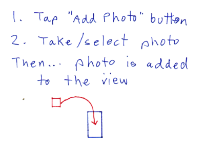  
<br>

You will be able to do the following touch tasks for each photo:  
1. Move it, using a tap-and-drag gesture  
2. Bring it to the foreground, if it is partially covered by another photo, by using a single tap  
3. Removing it from the view (i.e. delete), by using a press-and-hold (for two seconds) gesture  
<br>

### Getting started
Create a new iOS app, using the Single View Application template. The name of the app should be **FriendPix**. 

It should target the iPhone, and do not use source control (e.g. git).

#### App cleanup
It is possible that you will have to configure/set a development team. For ease of use, select the "Personal Team" item.  

The project template created a view controller with the source code file named "ViewController.swift". Inside that source code file, the class name is "ViewController".  

Those names are OK for the project template code generator, but we do not like them. So, let's fix them.

**Source code file rename** - In the project navigator panel, click to select the ViewController.swift source code file. Then press the `Tab` key, and its name will be selected, ready for you to type the new name.  

What name should we use: How about "PhotoSurface.swift".  

**Class rename** - Open the PhotoSurface.swift source code file for editing. Simply replace the class name "ViewController" with "PhotoSurface".  

Are we done? No. Why? The storyboard scene is still configured with the "ViewController" name. So, if you attempt to run the app now, it will fail.  

Here's how to fix that: Open the Main.storyboard for editing. Select the "View Controller" icon in the top area of the scene's rectangle. On the right-side Identity Inspector (the third icon over), notice the "Custom Class" section of settings. Currently, the "Class" is the old bad value. Simply change it to the new "PhotoSurface" value.  

Build and optionally run to ensure that the cleanup tasks were done correctly.  
<br>

### Think about the app's code design (classes etc.)
You already know that the app will have a view controller class (PhotoSurface).  

We will need one more separate class, to define and describe a photo. Although it is technically possible to do what we need to without a separate class, it is a much better and cleaner design to have one.  

The new class - Photo - will be a subclass of UIImageView. In the "shapes" code examples, you saw that we created a "Shape" class, which was a subclass of UIView. Well, for us, UIView doesn't have enough.  

UIImageView is a sublcass of UIView, so it has all its goodness. In addition, it is specifically designed to hold an image (photo), and has features that are nice and useful for image-handling.  

Similar to the "shapes" code examples, we will add touch and gesture handlers to the new class. All the functionality in one place. Nice.  

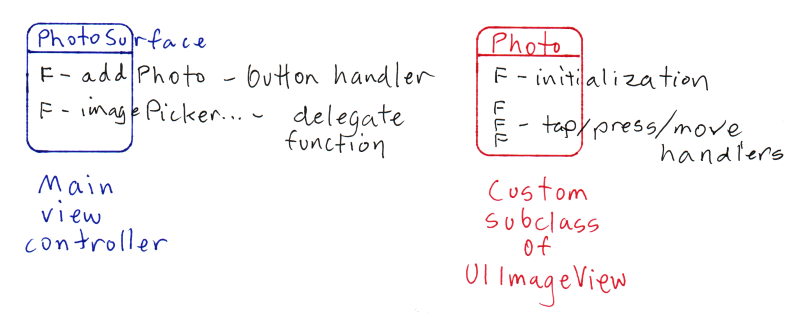  
<br> 

### Configure the scene
The scene will have a very simple configuration. It will have one button. So, add it now. It's text can be something simple like "Add Photo".  

Then, add a connection - an action - for the button. The action (function) name can be something simple like "addPhoto". For best results, in the Connection dialog, make sure the Type is UIButton.  

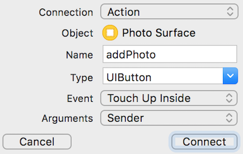  
<br>

Optionally, you can make the background black, instead of white. How?  
1. Make sure the Document Outline is showing, so that you can see the view hierarchy.  
2. Select the "View" object in the Document Outline. You will notice that the rectangle will have a light blue shade, indicating that it has been selected.  
3. On the right-side Attributes Inspector, look for the "Background" setting in the "View" section of settings. You probably know how to do the rest.  
<br>

### Write code for the new Photo class
To plan for this task, study (again) the "shapes" code examples. Notice that their "Shape" classes have:  
- initialization and configuration  
- custom drawing  
- touch/gesture handlers  

Well, in our class, we will need *initialization* and *touch/gesture handlers*. Our job is simple enough that we will not need custom drawing (and anyway, we're not really drawing anything, because the image/photo is the content to be rendered). 

First, add the source code file to hold the new class. In the left-side project navigator, click/select the "FriendPix" group (folder). Add a new file. (There are at least three ways to do this; use your common sense and experience with other editor enviroments to figure out how to do this task.)  

The template for a Swift class is "Cocoa Touch Class".  
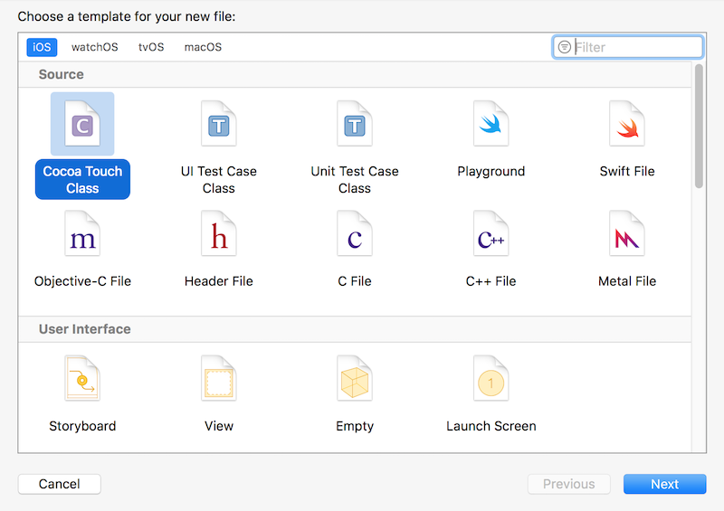  
<br>

Its name can be something simple like "Photo", and it should be a subclass of UIImageView.  

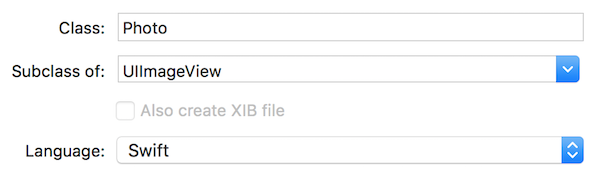  
<br>

#### Initialization - part one
In subclasses of UIImageView (and UIView), we must write the initialization function(s). (We will need two here.)  

Here's the code-writing cadence that you can use here, and into the future. First, in the class, type "init" and allow the code sense to show you the choices.  

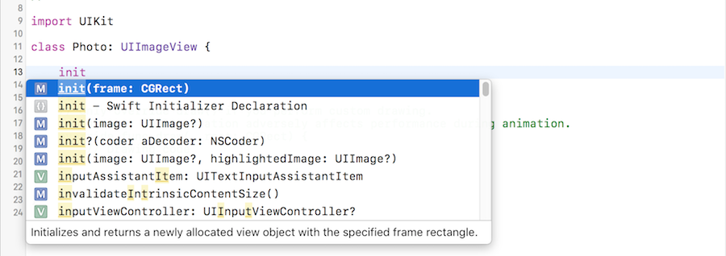  
<br>

Choose the highlighted choice, with the "frame: CGRect" parameter. It gets added to the class. After a few seconds, the compiler will complain.  

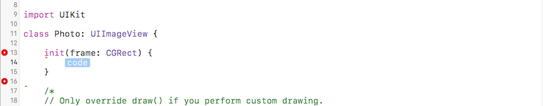  
<br>

Click the first error (stop sign). It tells you how to fix. Accept the fix.  

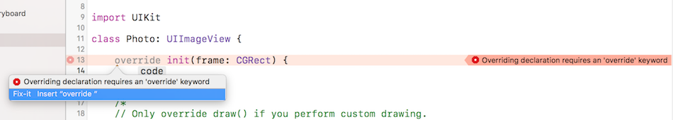  
<br>

Next, click the remaining error. It tells you how to fix. Accept the fix.  

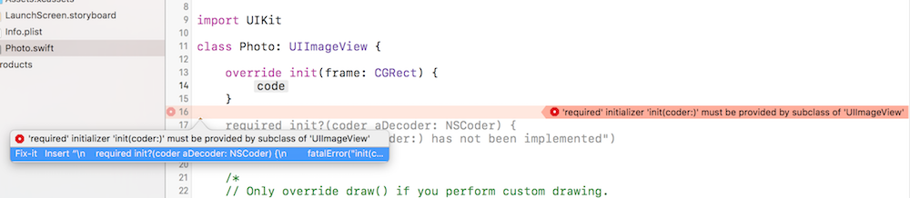  
<br>

At the end, you will have two initialization functions. The first one is used by us in our view controller code. The other is required for compatibility (and you may learn about that in the future). 

  
<br>

Soon, you'll learn how to replace the code in the "required init?" function.   

We do not need the commented out draw code, so you can remove that commented code block, if you wish.  
<br>

#### Initialization - part two
Above, you added the "init" functions that are needed for compatibility and convention. In all initialization situations, we need to do the same set of tasks. Therefore, let's follow the pattern that we learned in the "shapes" code examples. 

Add a new private function, probably named "commonInit".  

Now, go back and clean up the "init" functions. In "override init", call super (this is a convention), and then call commonInit:

```swift
super.init(frame: frame)
commonInit()
```

In "required init?", call super, and then call commonInit:

```swift
super.init(coder: aDecoder)
commonInit()
```

Soon, we'll come back to commonInit, and write code to work with the touch and gesture handlers.  
<br>

#### Touch / gesture handlers
As noted above, you will be able to do the following touch tasks for each photo:  
1. Move it, using a tap-and-drag gesture  
2. Bring it to the foreground, if it is partially covered by another photo, by using a single tap  
3. Removing it from the view (i.e. delete), by using a press-and-hold (for two seconds) gesture  

We will need handlers for each. Again, study the "shapes" code examples. 

The "touchesMoved" handler, as is, will probably work (for task #1 above).

The "tapSingleHandler", as is, will probably work (for task #2 above).  

For task #3 above, we will need a new handler (function). There is a "long press" gesture recognizer available, so we'll configure that soon. In the new handler, we'll just remove it ("self") from its superview. In other words, the photo object will remove itself from the photo surface. 

Look in the [UIView Class Reference](https://developer.apple.com/reference/uikit/uiview) document for a function that can do the remove task.  
<br>

#### Initialization - part three (touch/gestures)
Now we can circle back to the commonInit function, and add the gesture recognizers for tap single and long press. 

The tap single gesture recognizer settings will be the same as you saw in the "shapes" code example. 

Before configuring the long press gesture recognizer settings, briefly scan the [UILongPressGestureRecognizer Class Reference](https://developer.apple.com/reference/uikit/uilongpressgesturerecognizer) document. Were interested in one touch (which, if you follow the link in the documentation, is the default, so you don't really need a line of code for this), and a press duration of maybe two seconds (2.0, it's a Float). 

Now, interestingly, a subclass of UIImageView does not - by default - allow or enable user interaction. (A UIView subclass does, in contrast.) Therefore, add a statement to ensure that user interaction is enabled. If you have to scan the [UIImageView Class Reference](https://developer.apple.com/reference/uikit/uiimageview) document for the setting you want, do that.  
<br>

#### Initialization - part four (appearance)
Still in the commonInit function, let's do a few things to make your photos look nice. 

First, as you saw in the "shapes" code examples, set the background color to clear. 

Then, let's configure some settings for a photo. Refer to the UIImageView Class Reference document to learn more.  
1. The content mode, we want it to be scale aspect fill  
2. Optional, the corner radius, in/for the layer, can be something like 10.0 (it's a Float)
3. To enable both of these settings, turn on the clips to bounds setting  

> Want to learn a bit more about image resizing?<br>Mattt Thompson has a good post titled [Image Resizing Techniques](http://nshipster.com/image-resizing/)  

Now, we're all done with the Photo class.  
<br>

### PhotoSurface class coding
As you learned at the beginning, the app enables the user to take a photo, and then add it to the screen surface. In our code, we will need a function that will do each task.  

First, the "addPhoto" function enables the user to begin the process. There is a class - [UIImagePickerController](https://developer.apple.com/reference/uikit/uiimagepickercontroller) - that handles most of the work involved. Scan the documentation now, before continuing. 

It is a controller that we initialize and configure, using code. As you have read, it enables the use of the device's camera and/or photo library. For our app, we want to allow both, so that the development experience (i.e. when you're working on this assignment!) and the user experience on a device work without errors. To do that, we have to detect whether a camera is available, and if yes, use it. (Otherwise, use the photo library.) This is a common coding and use pattern in apps.  
<br>

#### Adopt the protocols that we need
The UIImagePickerController requires a delegate, so we configure the hosting class (PhotoSurface) to be the delegate. Then (as you'll learn below), we will implement one delegate function to handle the taken or selected photo.  

Before adding code to the addPhoto function, go up to the PhotoSurface class signature, add adopt (i.e. inherit) these two protocols:
1. UIImagePickerControllerDelegate  
2. UINavigationControllerDelegate  
<br>

#### Fill in the addPhoto function
The following is a coding pattern that you can use, as is (i.e. you have permission). It implements good practices, and is a blend of code from a number of people. Special note: See the "Test your work" section (below) for info and advice that you'll need when testing. 

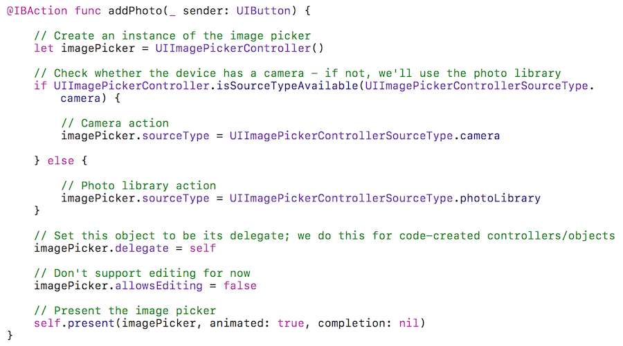  
<br>

#### Implement a delegate function
While a fully-featured app could or would implement a number of delegate functions (defined in the protocols), we are interested in only one:  

imagePickerController:didFinishPickingMediaWithInfo

Read the documentation for an overview of what it does.

What we want to do, essentially, is this set of tasks:  
1. Get the taken or selected photo  
2. Create a new "Photo" object, with a certain size, and configure it with the taken or selected photo  
3. Add the new "Photo" object to the view

The following is a coding pattern that you can use, as is (i.e. you have permission). It implements good practices, and is a blend of code from a number of people.  

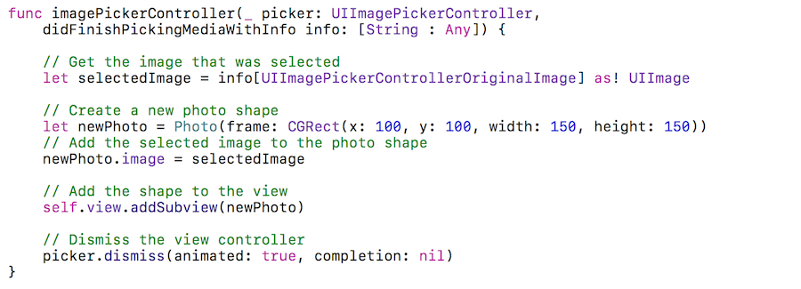  
<br>

### Test your work
It is likely that you will be working with the iOS Simulator app during the time that you're working on this assignment. Expect trouble. Why? Security settings. 

An app needs the user's permission to use the photo library on the device. In its default configuration, an attempt to use the photo library will fail. To fix this, we must add an *application setting*. 

In the left-side project navigator, you will notice a source code file named "Info.plist". This is a plain-text "property list" (although it is rendered as a table of key-value pairs). Select the source code file, and it will open in the editor.

In an open area in the editor, right-click, and Add Row. 

Select the row to begin editing its Key. You are looking for...

Privacy - Photo Library Usage Description

Set its value to a string, something like "Select and Display". 

After completing this task, the app will work correctly in the iOS Simulator. It will prompt the user for permission to use the Photo Library. 

(On a device, before using the camera, the app will also prompt the user for permission to use the camera.)  
<br>

#### Borrowing a device
If you have an iOS device, great, please use it in this course. 

If you do not have an iOS device, the School of ICT has a limited supply of iPod touch devices available for loan. We will begin loaning out the devices on Monday, January 30, 2017.  
<br>

#### Show / prove that your app works
Final testing of your app must be on a device, so that you can use the camera.  

Take photos of five (or more) of your friends. Arrange the photos on the photo surface in a way that pleases you. Then, take a screenshot. 

You can do this on the device itself, and then submit it with your project. Put it in the project folder, before doing the zip task.

Alternatively, using the Xcode Devices window (on the Window menu), you can use the "take screenshot" button, and it will be stored on the desktop. Again, put it in the project folder, before doing the zip task.  
<br>

### Submitting your work
Follow these instructions to submit your work:  
1. Make sure your project works correctly  
2. Locate your project folder in Finder  
3. Right-click the folder, and choose **Compress "(project-name)"**, which creates a zip file (make sure the zip file is fairly small, around 500KB or less)  
4. Login to Blackboard/My.Seneca, and in this course's Assignments area, look for the upload link, and submit your work there  
