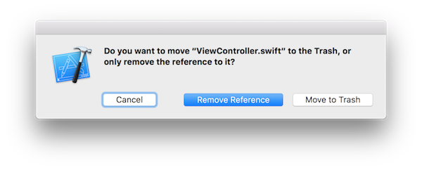
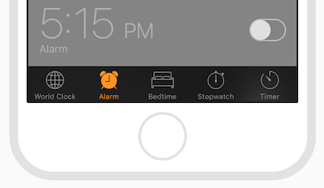
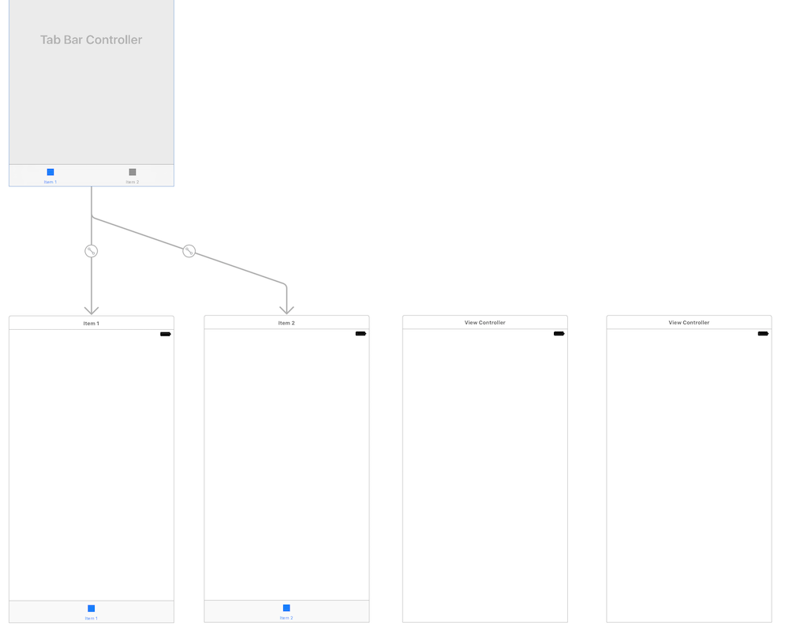
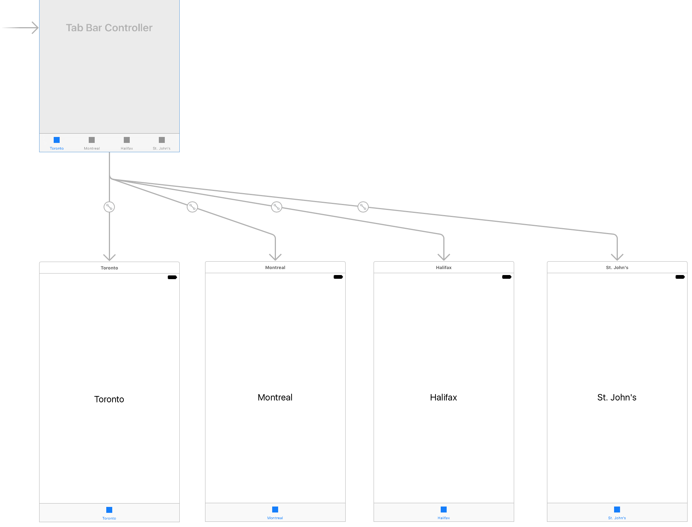
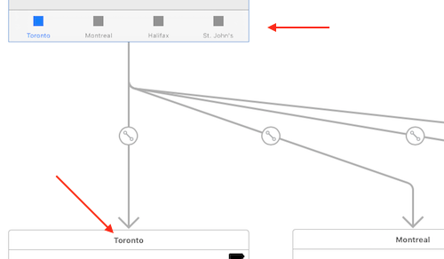
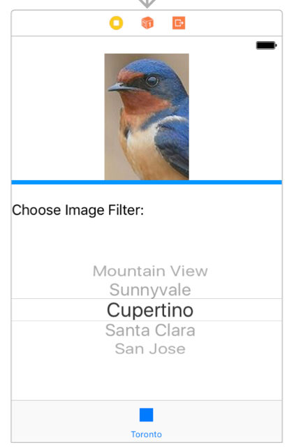
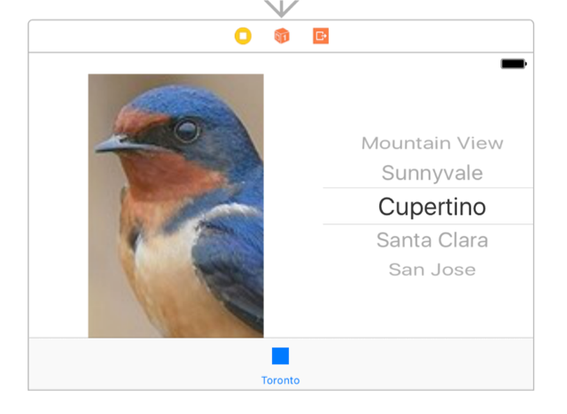
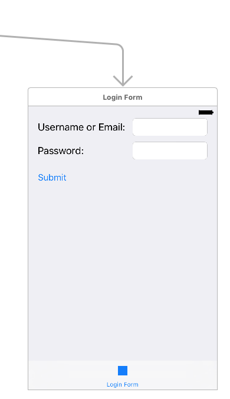

## DPS923 MAP523 Assignment 3 - LayoutFun

Assignment 3 enables you to show that you can work with and solve a number of typical layout challenges in an iOS app, on devices with different screen sizes and orientations. 
<br>

### Due date
Wednesday, February 8, 2017, at 11:00pm ET  
Grade value: 5% of your final course grade  

*If you wish to submit the assignment before the due date and time, you can do that.*  
<br>

### Objective(s)
Work with layout techniques  
Use and configure a stack view  
Learn about a *tab bar* controller that manages a collection of view controllers  
<br>

### Introduction to the problem that you will solve
We need an iOS app that has a number of scenes. Each scene has content that must show properly on different screen sizes and orientations. The content includes static-like user interface objects (labels, images, etc.), as well as interactive user interface objects (text fields, buttons, etc.).  
<br>

### Getting started
Create a new iOS app, using the Single View Application template. The name of the app should be **LayoutFun**. 

It should target *Universal* devices. Do not use source control.  

Show the "projects and targets list", and select the project. Configure the iOS Deployment Target to version 9.0, so that the app will work with all modern/typical devices.  

#### App cleanup
As you have seen before, the project creator process creates a "ViewController.swift" source code file. We do not need that, as we will be creating our own view controllers. Therefore, you can delete it. If a dialog asks the following, choose "Move to Trash". 

  

The project creator also creates a "Main.storyboard" source code file. Show the storyboard in the editor. 

We want to create our own scenes. Therefore, you can delete the existing "ViewController" scene.   
<br> 

### New topic for you - Tab Bar Controller
In this section of the document, you will learn about the *Tab Bar Controller*, something that is new to you. It will enable you to create your first iOS app that has more than one view/scene.  

A Tab Bar Controller manages a collection of view controllers (and their views/scenes). Therefore, it enables an app to have multiple views/scenes, which are somewhat logically related with each other (but not in a hierachical or dependency-driven relationship).  

For example, the iPhone's *Clock* app offers different (but related) kinds of clock (and time) related features, all in one app. The tab bar - at the bottom of the screen - enables an easy way to switch between the different features.  

  
<br>

From the [iOS Human Interface Guidelines](https://developer.apple.com/ios/human-interface-guidelines/ui-bars/tab-bars/) document:  

> A tab bar appears at the bottom of an app screen and provides the ability to quickly switch between different sections of an app.
>
> In general, use a tab bar to organize information at the app level. A tab bar is a good way to flatten your information hierarchy and provide access to several peer information categories or modes at once.  

<br>

Each section or feature of the app is enabled by a view controller + scene pair. Therefore, we'll create a number of view controllers, and then on the storyboard, we'll create a tab bar controller object, and then add a number of view controller scenes.  
<br>

#### Adding view controllers
In the project navigator, select (click) the LayoutFun group (yellow folder).  

Press Command+N to add a new item/file:
* iOS
* Cocoa Touch Class

On the next screen, choose these options: 
* Subclass of UIViewController
* Class (name) is `PhotoFilter`
* Language is Swift (obviously!)

Repeat the steps above to create view controllers `AllAboutMe`, and `UserInput`.

Later, we will return and write code for these new view controllers.  
<br>


#### Building the storyboard
From above, the storyboard should be empty.  

Locate *Tab Bar Controller* in the lower-right Object Library. Drag it on to the storyboard. Notice that three objects appear on the design surface, the tab bar controller, and two scenes, joined by lines (known officially as segues).  

If you wish, you can rearrange (drag) the boxes so that the tab bar controller is above the row of the two other scenes.  

Then, from the Object Library, locate then drag a *View Controller* to the design surface. Put it beside the two scenes. Do this again, to add a ~~fourth scene~~ third scene to the row (we will only do three). Here's how it may look now:  

  
<br>

**Configure the tab bar controller to be the initial view controller**  
Select the tab bar controller. On its Attributes Inspector, look for and check the box "Is Initial View Controller". When you do this, notice that an arrow appears on the left side of the tab bar controller box on the surface.  

**For each scene, configure its view controller**  
Each scene will be managed by a different view controller, which you just created earlier/above.  

Make sure that the storyboard editor is showing these:  
* The document outline panel (on the left side)
* The inspectors panel (on the right side)

For each of the three scenes...  
1. Select (click) its View Controller icon in the header  
2. Then, show its Identity Inspector  
3. In the Custom Class section (at the top), in the Class drop-down list/field, type or select its view controller  
4. Show its Attributes inspector, and then enter a descriptive (but short!) "Title" for the view controller  
5. Next, in the document outline, select (click) "Item" (which has a star icon)  
6. On the Attributes Inspector, enter the same descriptive "Title" text that you used above  
7. Optionally, add a Label to the scene, that has the same descriptive "Title" text that you used above (we'll remove the label later; you can use it during coding/testing/running to be sure that you're making progress)  

**Connect the new scenes to the tab bar controller**  
Notice above, that the two originally-placed scenes have lines/connectors to the tab bar controller. Those were done automatically, when you added the tab bar controller to the storyboard.  

Now, let's connect the other two new scenes. For each scene:  
1. Select (click) the tab bar controller  
2. Control+click+drag from the center of the tab bar controller box, to the new scene, and release the mouse/pointer button  
3. In the popup, choose "view controllers" from the "Relationship Segue" section of the popup  
4. Notice that a new line/connect is placed on the storyboard  

Here's how the storyboard may look now (**ignore the fourth item, we will only do three**):  

  
<br>

Look at the detail at the bottom of the tab bar controller, and the top-area title of its view controllers:  

  
<br>

Run the app in the simulator. Hopefully, it will load and run, and show the app's structure. You should be able to tap each of the items on the bottom tab bar, to switch scenes.  

<kbd>
  
</kbd>
<br>

Now, you're ready to do the layout tasks on the scenes.  

> A suggestion, hopefully helpful:
>
>The problem with layout is that sometimes you feel like you have clicked all the right buttons and it still isn't working. 
>
> Please be aware that sometimes you just have to remove the constraints, and build it again. There is no magic, just iterations, until you get it right. There is some inherent trial-and-error in using IB's layout tools. 

<br>

### Layout task 1 (on the **PhotoFilter** view controller)  
We have two tasks to accomplish on this scene (in addition to the layout task!). First, learn something new and fun about photo editing. And, get a little practice with a picker view.  

This will be the only scene with code that you must write in the PhotoFilter view controller. We'll cover that soon (below).  
<br>

#### Photo editing with Core Image Filters  
We can use Core Image filters to edit or change the appearance of images.  

FYI, the [Core Image Programming Guide](https://developer.apple.com/library/content/documentation/GraphicsImaging/Conceptual/CoreImaging/ci_intro/ci_intro.html) will introduce you to some of the things that you could possibly do to images. 

The  [Core Image Filter Reference](https://developer.apple.com/library/content/documentation/GraphicsImaging/Reference/CoreImageFilterReference/) document can also be helpful. 

This scene will have two objects:  
1. An image (UIImageView)  
2. A picker view (UIPickerView)  

In *portrait* mode, the two objects will be vertically stacked.

  
<br>

In *landscape* mode, the two objects will be horizontally side-by-side.
  
<br>

You only need to solve this for iPhones in landscape/portrait other than the iPhone **Plus** models (that is a special case of size class we can ignore for now). The plus models are the iPhone 6 Plus and the iPhone 7 Plus.

If you get the other cases solved, and would like to get it working on the 6 Plus or 7 Plus for fun, you are welcome to add that.

(Hint - stack view, size classes and vary for traits)

#### Some code for you to use for the picker

Here is a list to use for the picker:
```swift
 let filterNameList = ["No Filter" ,"CIPhotoEffectChrome", "CIPhotoEffectFade", "CIPhotoEffectInstant", "CIPhotoEffectMono", "CIPhotoEffectNoir", "CIPhotoEffectProcess", "CIPhotoEffectTonal", "CIPhotoEffectTransfer"]
```

And here is the code you can run when an item in the picker is selected:
```swift
    let sourceImage = CIImage(image: self.imageView.image!)
    // introducing guard statement as a cleaner form of "if let" for early return from functions
    guard let filter = CIFilter(name: filterNameList[row]) else {
        print("Can't create filter")
        return;
    }

    filter.setDefaults()
    filter.setValue(sourceImage, forKey: kCIInputImageKey)
    let context = CIContext(options: nil)
    // introducing: multiple "if let" in one statement, quite handy!
    if let outputImage = filter.outputImage,
        let outputCGImage = context.createCGImage(outputImage, from: outputImage.extent) {
            let filteredImage = UIImage(cgImage: outputCGImage)
            self.imageView.image = filteredImage
    }
```

You can figure out where to put the above code. Note that this code doesn't reset the image back to normal; it just keeps applying filters as they are picked. You can add that if you like, but it isn't required for the assignment. This part is just a chance to hook up a picker view to do something interesting.

<br>

### Layout task 2 (on the **AllAboutMe** view controller)  
Think back to your work on Assignment 1, the "All About Me" app. It is possible that you had layout problems, and did trial-and-error tasks to fix the layout problems.  

Now that you have learned something about layout techniques, add a layout to this scene.

You **don't need to make the UI functional** this is just a layout exercise. You should be able to copy the UI from that assignment into the view for this tab. Then use layout techniques to apply a layout. We won't test that the items on the scene are hooked up to actions.

You only need to get this working in portrait for this assignment.

(Hint - stack views, view constraints and layout handles)  
<br>

### Layout task 3 (on the **UserInput** view controller)  
On this scene, we'll do a very typical and often-implemented UI task - working with user input into text fields (UITextField).  

As an example, we'll use a typical "login screen" example, with two (correctly configured!) text fields and a button.  


<br>

<br>
### Test your work
Run the app on the iOS Simulator, using different devices (that have different screen sizes):  
1. iPhone SE or 5 (4-inch screen)  
2. iPhone 7 (4.7-inch screen)  
3. iPad Pro (9.7-inch screen)  

Make sure that the content lays out nicely, in portrait mode, on all of these screen sizes.
<br>

#### Borrowing a device
If you have an iOS device, great, please use it in this course. 

If you do not have an iOS device, the School of ICT has a limited supply of iPod touch devices available for loan. Contact Professor McIntyre to request a device.  
<br>

#### Show / prove that your app works
Final testing of your app must be on a device. Then, take a screenshot. 

Screenshots can be taken:
- on the device itself
- using the Xcode Devices window (on the Window menu), you can use the "take screenshot" button, and it will be stored on the desktop.
- in the Simulator, File>Screenshot, it will store the file on the desktop

In this assignment, the simulator is the easiest method because of the number of different screens.

Submit it with your project. Put it in the project folder, before doing the zip task.

Please include a screenshot of:

1. tab 1 portrait on an iPhone
1. tab 1 landscape on an iPhone non-Plus model
1. tab 2 portrait 
1. tab 2 portrait on an iPad
1. tab 3 portrait on an iPhone
1. tab 3 landscape on an iPhone non-Plus model

Recall that the 'Plus' model iPhones in landscape have a special size class (vs. other iPhones in landscape), and this assignment doesn't require a solution for that.
<br>

### Submitting your work
Follow these instructions to submit your work:  
1. Make sure your project works correctly  
2. Locate your project folder in Finder  
3. Right-click the folder, and choose **Compress "(project-name)"**, which creates a zip file (make sure the zip file is fairly small, around 500KB or less)  
4. Login to Blackboard/My.Seneca, and in this course's Assignments area, look for the upload link, and submit your work there  
