## DPS923 MAP523 Assignment 4 - Quarterback Statistics

Assignment 4 enables you to create a navigation-style app, with two levels of navigation (list and detail). Also enables you to get hands-on experience with the iOS table view infrastructure, and a model object.  
 

### Due date
Wednesday, February 15, 2017, at 11:00pm ET  
Grade value: 5% of your final course grade  

*If you wish to submit the assignment before the due date and time, you can do that.*  
 

### Objective(s)
Create an app with more than one view, as a navigation-based app, with two levels (list and detail)  
Work with a model object, and use an array collection  
Understand and implement the delegate pattern, using a table view  
 

### Introduction to the problem that you will solve
We need an app that will display performance information for quarterbacks in the just-completed 2016 season in the National Football League.  

The app’s first view will be a table view, showing a list of quarterback names. Tapping one of the rows will display a ‘details’ page, with the player’s statistical performance information.  

Read through this assignment fully before starting work on it. That way you will know what’s coming.  

<kbd>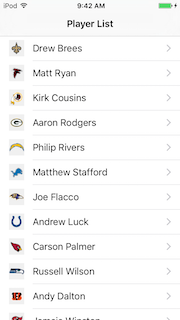</kbd>&nbsp;<kbd>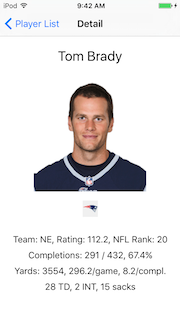</kbd>

 

### Getting started
Create a new iOS app, using the Single View Application template. The name of the app should be **QBStats**. 

It should target *iPhone* devices. Do not use source control.  

Show the "projects and targets list", and select the project. Configure the iOS Deployment Target to version 9.0, so that the app will work with all modern/typical devices.  

#### App cleanup
As you have seen before, the project creator process creates a "ViewController.swift" source code file. We do not need that, as we will be creating our own view controllers. Therefore, you can delete it. If a dialog asks, choose "Move to Trash". 

The project creator also creates a "Main.storyboard" source code file. Show the storyboard in the editor. 

We want to create our own scenes. Therefore, you can delete the existing "ViewController" scene.   
  

### Add the controllers and the data
We need two controllers: One for the list, and one for the detail.  

In the project navigator, select (click) the QBStats group (yellow folder).  

Press Command+N to add a new item/file:
* iOS
* Cocoa Touch Class

On the next screen, choose these options: 
* Subclass of UI**Table**ViewController
* Class (name) is `PlayerList`
* Language is Swift (obviously!)

Do this again to add the 'detail' controller:
* Subclass of UIViewController
* Class (name) is `PlayerDetail`

#### Add data
Your professors have extracted the data you need from NFL.com. Its data format is known as a "[property list](https://en.wikipedia.org/wiki/Property_list)", which is a plain-text XML data format that’s widely used in iOS and macOS apps. 

The property list, named "stats2016qb.plist", is inside a "Assignment4Data.zip" file that you can find in the "assignment-assets" folder on GitHub. Download the zip file, and double-click to enable Finder to open it. 

Next, add the property list file to the project: Right-click the "QBStats" group (folder icon), and choose "Add Files to QBStats...". Make sure that you "copy" the items by checking/marking the checkbox (click the Options button to reveal the checkbox).

If you wish, you can look at the data file. Xcode will show it as an ‘array’ of ‘dictionaries’. if you open one of the dictionaries (e.g. "Item 2"), you will see some key-value pairs with player data.

<kbd>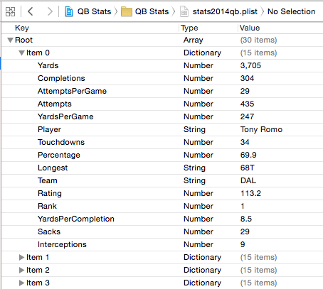</kbd>

 

#### Add player photos and team logos
The "Assignment4Data" file also contains a folder of player photos, and team logos. 

Player photos are 200px square, so make sure that this size is used for the UIImageView object that you add to a scene later (described below). 

Team logos are 27px wide and 29px tall, so again, make sure that this size is used for the UIImageView object that you will add to a scene.

How do you add these assets to your project? By using the *asset catalog*. Then:  
1. In the project navigator, select (click) the *Assets.xcassets* item. The center editor panel will show an organizer panel, and an item preview panel.  
2. Then, at the bottom of the organizer panel, select (click) the plus sign, and choose "Add Folder". The first folder name can/should be "photos".  
3. Do this again, and add another folder named "logos".  

Now, we're ready to add the photos:  
1. At the bottom of the organizer panel, select (click) the plus sign, and choose "Import...".  
2. Navigate to the file system location that holds the player photos.  
3. Select all of the photos, and then complete the import task. 

Do the same for the team logos.  
 

### Add the "list" scene on the storyboard
This will be a navigation-based app.

We will need a table view (as the initial scene), and a standard/normal view as the drill-down ‘detail’ scene.

Select the storyboard.

From the Object Library at the bottom of the right-side utility area, select the “Navigation Controller” item. Drag that to the storyboard. It will add two rectangles:

1. The “Navigation Controller” rectangle will be managed by a UINavigationController instance. It provides a number of useful services to the app, including navigation, and a title bar that can hold text and action buttons.  
2. The “Table View” rectangle will be managed by the “PlayerList” controller we added above.  
 

#### Configure the Navigation Controller on the storyboard

Select the “Navigation Controller” icon on the scene’s dock.

On the Attributes Inspector, check (select) the “Is Initial View Controller” check box. An arrow should then appear to the left of the scene’s rectangle.  
 

#### Configure the Table View on the storyboard

Select the “View Controller” icon on the scene’s dock.

On the Identity Inspector, select the “PlayerList” item in the Class dropdown (in the “Custom Class” section at the top).

Select the white-and-empty rectangle just below the “Prototype Cells” prompt. We need to configure its behaviour:

1. On the Attributes Inspector, set its Style to “Basic”  
2. Set its Identifier to the string “cell”  
3. Set its Accessory to “Disclosure Indicator”
Now, change the scene’s visible title (on its ‘navigation bar’ area). Double-click the “Root View Controller” string, and replace it with something better (like “Player List”).

#### Test your work
Edit the PlayerList controller:

From numberOfSections(in tableView:), `return 1`.

From tableView(numberOfRowsInSection:), `return 5`.

Uncomment the tableView(cellForRowAt indexPath: ) function. Then. set the cell’s textlabel?.text property to something, as suggested below (click for full size):  

<kbd>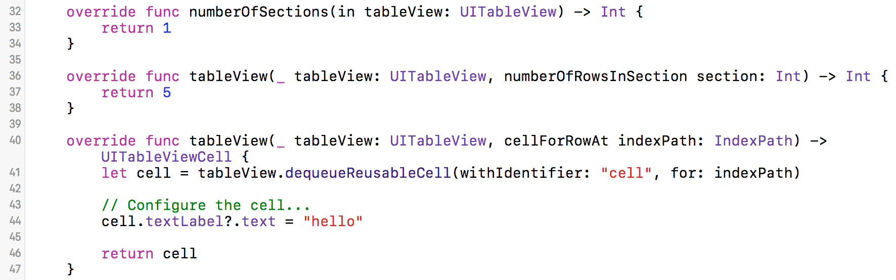</kbd>  
 

Then, build-and-run the app, and it should display something useful:  

<kbd>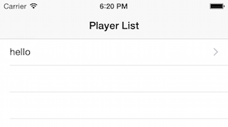</kbd>  
 

### Add the "detail" scene to the storyboard
Back on the storyboard, we will add another scene. For best results, double-click an open (white) area of the storyboard, just to the right of the existing scenes.

> Double-click is a zoom toggle. Each time you double-click, it will zoom in, or zoom out.

From the Object Library, drag a View Controller to the storyboard, and position it to the right of the “Table View”.

Select the “View Controller” icon on the new scene’s dock. We will configure its controller: On the Identity Inspector, set the Class to “PlayerDetail”.

> Optional – If you wish, you can set a title for the scene. (Most often however, this is done programmatically.) On the Attributes Inspector, set the Title to “Player Detail” or something similar.

Next, select the ‘prototype cell’ rectangle on the Table View. Control+click-drag to the new scene. 

> Be careful - make sure that you are selecting the right object. If you need to be sure, show the document outline panel, and locate the "Table View" on that panel.

On the popup, select Selection Segue > show:

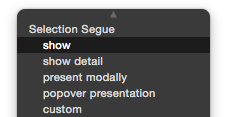  
 

Adding a segue will ‘join’ the two scenes together, as a navigation action. Select the arrow that joins the scenes. On its Attributes Inspector, set the Identifier value (it’s a string) to “toPlayerDetail”.

At this point, you can add four labels and an ‘image view’ to the scene. Here’s an example of what it could look like:

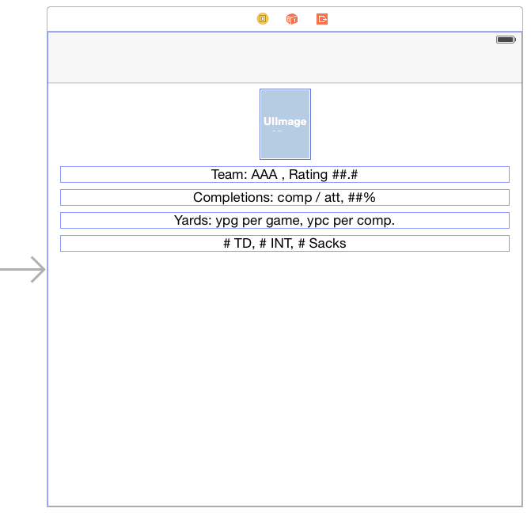  
 

While you’re here, you could also add outlets for each of these five user interface objects.

Also, at some point in time, you will have to configure the layout so that it works well on different screen sizes.  
 

#### Test your work

When you build-and-run the app, you will be able to tap on the row, and navigate to the ‘detail’ scene.  
 

### Add and configure the model class
In the Project Navigator, select the “QB Stats” group (folder icon), and add a new item (Command+N).

It will be a Swift File, named “Model”.

Add code to create a class named “Model”. It will have one property, named "players". For this lab, follow the guidance below to add the code to the class.  

<kbd>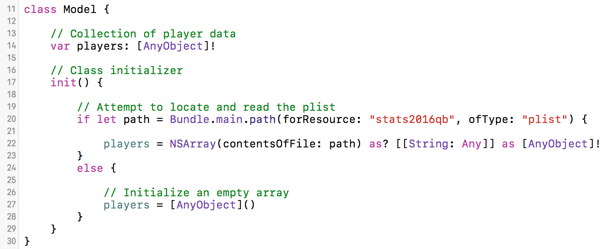</kbd>  
 

The ‘players’ property is an array. In Swift, the array’s data type is AnyObject.

Each ‘player’ object is a dictionary-like data structure, with key-value pairs. Later, we will use that object as a Swift Dictionary<String, AnyObject>.  
 

### Initialize the model object in the app delegate, and pass it to the ‘root’ controller (PlayerList)

Edit the app delegate source code. In the body of the application(didFinishLaunchingWithOptions: ) function, add code that will pass the model object to the PlayerList controller.

Follow the guidance below. Don’t worry about the build/compile error, you will fix that soon.

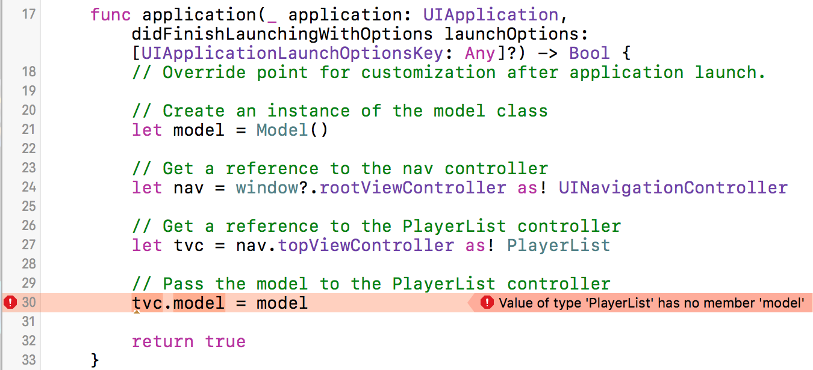  
 

### Edit the PlayerList controller code
The "new item" template creates a controller with a number of function stubs. We will use the following functions:

* viewDidLoad()
* numberOfSections(in tableView)
* tableView(numberOfRowsInSection: )
* tableView(cellForRowAt indexPath: )
* prepare (forSegue: sender: )

You can delete the others if you wish.  
 

#### Add a model object property

Add a model object property. After you add it, the project will build/compile without errors.  
 

#### Configure the table view dimensions

The model object has a ‘players’ property. It is an ‘array’ of ‘dictionary’ objects.

Hard-code the numberOfSections(in tableView) function return value to 1.

In the tableView(numberOfRowsInSection: ) function, return the count (size) of the players array.  
 

#### Configure the row contents

The controller’s ‘model’ object has a ‘players’ collection. We will extract the player names, and display them on the table view rows. Here’s the algorithm:

1. From the data source, extract the player object for the tapped/selected row
2. Extract the player name from the player object
3. Set the cell’s text label property to the player name

Follow this guidance:

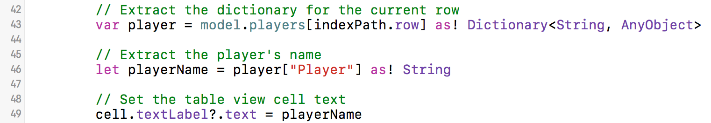  
 

#### Team logos

The “Basic” table view cell style includes space for a small image, on the left side. If we configure that image in code, it will appear.

Each player’s object has a “Team” key-value pair. The value is a two- or three-character team name (e.g. SEA = Seattle, NE = New England, etc.). We use that value to look for an image with a matching name.

Here’s some guidance:

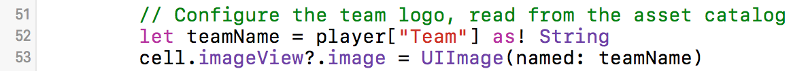  
 

#### Write code for the segue

Your app will segue from the list to the detail scenes. Now, we will write code to pass data to the detail scene.

The prepare(forSegue: sender:) method is commented out. Make it active.

It is possible that a scene could have a number of segues to other scenes. Therefore, we always wrap our code in an ‘if’ statement to ensure that we’re working on the desired segue.

Then, the design and coding algorithm is as follows:

1. Get a reference to the destination view controller
2. Get a reference to the data source object for the tapped/selected row
3. Pass the object on to the destination view controller
4. Perform other tasks as needed (e.g. set the destination title)

Here’s some guidance. Please note that the ‘player’ property does not yet exist in the destination scene’s controller, so the editor will show an issue:

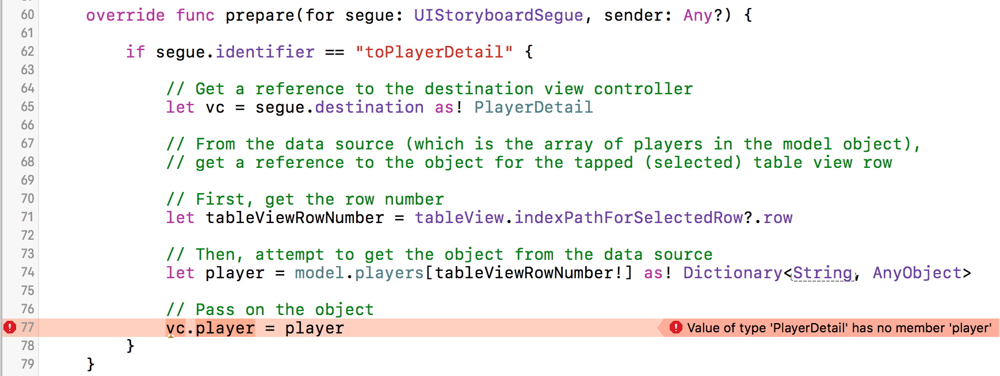  
 

### Edit the PlayerDetail controller
Add a property for the passed-in player object. After you add it, the project will build/compile without errors.

In viewDidLoad, you will extract string and number data from the player object, and make strings for the labels on the scene. Try to match the data formatting that you see in the sample screen capture near the top of this document. 

> Need to know or learn about quarterback statistics?  
> Use a search engine, and enter a string similar to...  
> how to read a quarterback's statistics

> In class, your professor will show you a best practice technique for planning and coding.  
>  
> The incoming data object is a Dictionary, which has a easy-to-use but awkward syntax for dereferencing (accessing) values. The important part of the technique is to create constants for the values. Then, the *string interpolation* syntax is MUCH easier and more readable. 

 
For the photo, the player’s name will be used to match up to a photo that's in the asset catalog.

For the team logo, the player's team will be used to match up to a logo that's in the asset catalog.
 

### Layout considerations
The app should work on different iPhone screen sizes. When coding the "details" scene, use layout features to *center* the content left-to-right. 

### Test your work
Run the app on the iOS Simulator, using different devices (that have different screen sizes):  
1. iPhone SE or 5 (4-inch screen)  
2. iPhone 7 (4.7-inch screen)  
3. iPhone 7 Plus (5.5-inch screen)  

Make sure that the content lays out nicely, in portrait mode, on all of these screen sizes.  
 

#### Borrowing a device
If you have an iOS device, great, please use it in this course. 

If you do not have an iOS device, the School of ICT has a limited supply of iPod touch devices available for loan. Contact Professor McIntyre to request a device.  
 

#### Show / prove that your app works
Final testing of your app must be on a device. Then, take a screenshot of **each** scene (list and detail). 

Screenshots can be taken:
- on the device itself
- using the Xcode Devices window (on the Window menu), you can use the "take screenshot" button, and it will be stored on the desktop.
- in the Simulator, File>Screenshot, it will store the file on the desktop

Submit **both** screenshots with your project. Put them in the project folder, before doing the zip task.  
 

### Submitting your work
Follow these instructions to submit your work:  
1. Make sure your project works correctly  
2. Locate your project folder in Finder  
3. Right-click the folder, and choose **Compress "(project-name)"**, which creates a zip file (make sure the zip file is fairly small, around 1MB or less)  
4. Login to Blackboard/My.Seneca, and in this course's Assignments area, look for the upload link, and submit your work there  

