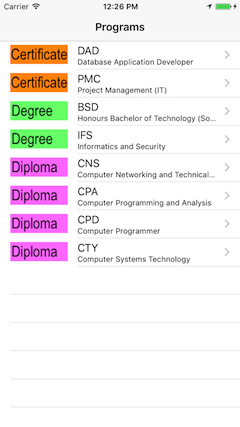
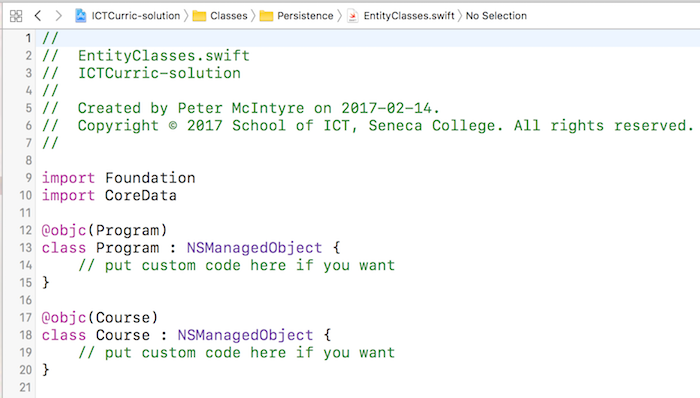
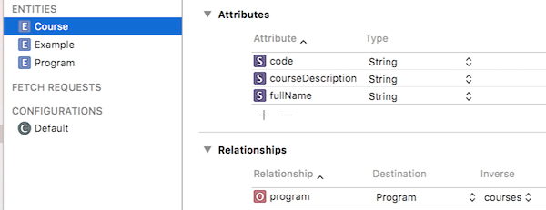
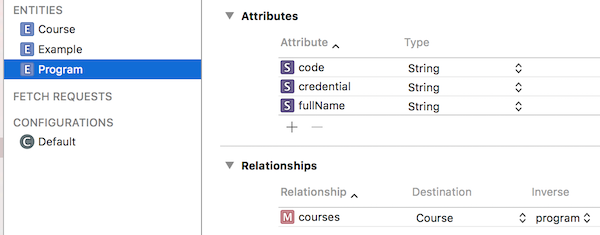
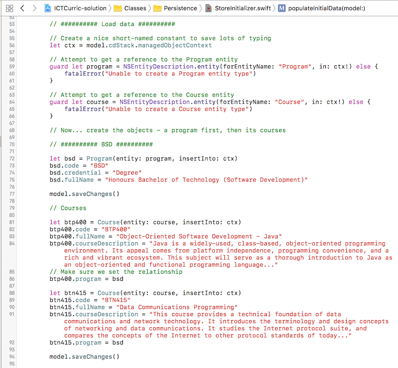

## DPS923 MAP523 Assignment 5 - School of ICT Curriculum

Assignment 5 enables you to begin working with on-device storage, using Core Data. You will create a navigation-style app, with three levels of navigation (list, list, and detail).  
<br>

### Due date
Wednesday, February 22, 2017, at 11:00pm ET  
Grade value: 5% of your final course grade  

*If you wish to submit the assignment before the due date and time, you can do that.*  
<br>

### Objective(s)
Use Core Data for on-device storage and querying.
Create an app with more than one view, as a navigation-based app, with three levels (list, list, and detail)  
Continue using the foundation topics from previous classes.  
<br>

### Introduction to the problem that you will solve
We need an app that will *display* information about some academic programs in the School of ICT. (Display-only, the app user will not be creating or editing information.)  

The app's start screen is a list, and will be managed by a table view controller. It will display a list of some of the academic programs in the School of ICT. 

When the app user taps/selects an item on the list, another list (managed by a table view controller) will slide in, and display a list of courses in that academic program.  

When the app user taps/selects an item on the list, a details screen (managed by a standard view controller) will slide in, and display some information about that academic program. 

> screen captures will be pasted here  

<br>

<kbd></kbd>  
<br>

### Getting started
Get (download) the Assignment5Data.zip file, which is in the GitHub repo. (Its path is assignments/assignment-assets.)  It has some data and images (icons) that you will use in your app.

Get (download) the CoreDataModel app, which is in the GitHub repo. (Its path is notes/Project_Templates.) 

Follow the instructions in its [Readme.txt](https://github.com/dps923/winter2017/blob/master/notes/Project_Templates/CoreDataModel/Readme.txt), to create an iOS app named **ICTCurric**.  

Show the "projects and targets list", and select the project. Verify that the iOS Deployment Target is set to version 9.0, so that the app will work with all modern/typical devices.  
<br>

#### Verify that the app runs  
First, run the app in the iOS Simulator, so that you know that it does successfully run. It will display a list of your professors' names, and enable you to tap/select a name to show a details view (which has a title that matches the tapped/selected professor name).  

Next, return to the iOS Simulator's home screen. Delete the app. How? Tap (click) and hold, until all the icons show an "X" badge and begin wiggling. Tap/click the "X" badge, and confirm that you want to delete the app. 

> Why must we do this?  
> Any time we make changes to the Core Data model, it invalidates any existing model and data. The easiest way to handle this now is to simply remove the app from the device (or iOS Simulator).  
> Later in the course, you will learn how to "migrate" a Core Data model to a new version, and save its data too.  

<br>

#### App cleanup
There will be several cleanup tasks, but we'll do them later. Why? We want to leave the "Example" code bits in the project, until we have added replacements. That way, your app can be built incrementally, and it will still run successfully.  
<br>

#### Task preview
In the sections that follow, you will perform these tasks:  
1. Design the entity classes for Program and Course, and generate custom subclasses for the entities  
2. Write code in the store initializer to create startup data for the app  
3. Create a fetched results controller for the Program collection  
4. Create a controller for the Program list view  
5. Create a controller for the Course list view  
6. Create a controller for the Course detail view  
7. Update and design the storyboard scenes/views  
8. Update the code in the app delegate and new controllers  
9. Clean up the project  
<br>

### Design the entity classes for Program and Course  
Add a new Entity (by using the button at the bottom of the editor). The entity name will be "Program". Next, add attributes. All will be strings.  
* code  
* credential  
* fullName  

In the right-side Data Model Inspector, un-check (clear) the "Optional" checkbox for each of these attributes.  
<br>

Add another entity, named "Course". Next, add attributes. All will be strings.  
* code  
* courseDescription  
* fullName  

In the right-side Data Model Inspector, un-check (clear) the "Optional" checkbox for each of these attributes.  
<br>

#### Do the code generation tasks
Recently, you learned that it was a good idea to use *code generation* to make it easier and better to work with model objects in your apps. Here, we perform this configuration.  

For each new entity class - Program and Course - set the value of the "Codegen" setting to "Category/Extension". Remember, you do that in the Data Model Inspector.

Next, write entity classes. Here, we will use a single source code file to hold both new entity classes. To do this, create a new Swift file, named "EntityClasses.swift". Then, write the code. This is what you want to end up with:  

  
<br>

#### Create the relationships
For this assignment, we will assume a one-to-many relationship:  
* A Program object has a collection of zero or more Course objects, or...  
* A Course object is always related to exactly one Program object  

Start by selecting the Course object in the editor.  Add a relationship:  
* The *name* of the relationship will be *singular*, "program"  
* Its *destination* will be the Program entity class  

Next, select the Program object in the edtor. Add a relationship:  
* The *name* of the relationship will be *plural*, "courses"  
* The *destination* will be the Course entity class  
* Choose "program" as the *inverse* relationship  

Now, re-select the Course entity. Notice that the editor has already configured/updated the relationship's inverse value. Here's what your entity configurations should look like. First, Course:  

  
<br>

Then, Program:  

  
<br>

Now, we need to edit the relationships, in the right-side Data Model Inspector.  

First, select the Course entity, and then its "program" relationship:  
* Un-check (clear) the "Optional" checkbox (in other words, a course MUST be related to an existing program)  
* Leave other settings as-is (including the Type setting, "To One")  

Then, select the Program entity, and then its "courses" relationship:  
* Change the Type setting to "To Many"  
* Leave other settings as-is (including the Optional setting, on/marked/checked)  

At this point in time, your app should build correctly, without errors.  
<br>

### Write code in the store initializer to create startup data for the app  
Recently, you learned that the store initializer class has a function that will enable you to programmatically create initial data for your app. We will edit this function, to add program and course data (which you can copy from the Excel workbook, mentioned above).  

Here are a few best practices when adding data that has relationships:  
* Use meaningful constant/variable names for all objects  
* Add the dependent (to-one) object first, and save it  
* Then, add its collection of objects - make sure that you set/configure the value of the relationship property  

When you set/configure the value of one end of a relationship, the Core Data framework automatically sets/configures the other end of the relationship.  

What startup data must be created?  

Add academic program data for ALL programs.  

Then, if you are in the BSD program, add the five (5) courses that are in the program's level 4.  

Alternatively, if you are in the CPA program, add the five (5) courses that are in the program's level 4.  

The following image shows how you would add data for an academic program, and some of its courses. This technique can be used for any similar situation in the future:  

  
<br>

### Create a fetched results controller for the Program collection  
Study the Model class. You will see that it has a property named "frc_example", and its value is initialized in the `init()` function.  

As you have learned, this property is the *fetched results controller* (frc) object, which manages a fetch request for the "Example" entity, for the benefit of a table view controller.  

We will follow its coding pattern to create an frc for the "Program" entity:  
1. Near the top of the class, add a property named "frc_program"  
2. Initialize its value in the `init()` function; choose one of the Program attributes as the sort descriptor key  
<br>

### Create a controller for the Program list view  
In this section, you will create a *new* view controller, which will display a list of Program objects. The contents and layout of the new controller will be similar to the ExampleList controller that's included in the project template.  

There are a number of programming tasks that must be done:  
1. Create the new controller class  
2. Configure it for use with Core Data and our app architecture (in other words, the Model class)  
3. Write the initialization code  
4. Write the code that will render the data in the table view  
<br>

#### Create the new controller class  
In/under the Classes group, create a new Cocoa Touch Class. It will be a subclass of UITableViewController (right?). Name it "ProgramList" (for consistency).  
<br>

#### Configure it for use  
Before the class declaration, add another import statement, `import CoreData`.  

Next, study the ExampleList controller code. Use its code and organization as an example of how you should write code for ProgramList. It will need properties to hold a reference 1) to the model, and 2) to its frc.  
<br>

#### Write the initialization code  
In `viewDidLoad()`, initialize the frc, using the pattern that you see in the ExampleList controller.  
<br>

#### Write the table view rendering code   
You have probably seen enough code examples to observe that the table view rendering code is done with several functions, and each is responsible for a specific task. (Remember, these functions are called by the iOS runtime as it is preparing to show the view on the screen.)  

In a table view controller that uses our app architecture, we typically use four functions. Study the ExampleList controller, and then write the code for these functions in ProgramList:  
1. Number of sections in table view  
2. Number of rows in a section  
3. Define the cell for the row at an index path  
4. Configure cell contents  

You will learn that the code for the first three functions is the same for all table view controllers. 

> Well, *almost* all.  
> When used with an frc, the first two will get their return values from the frc.  
> Alternatively - as you have seen before - when used with a collection (like an array), they get their return values from hand-coded values and the size (item count) of the collection (array).  

Only the function that actually configures the cell contents differs as different entity objects are rendered.  

For this assignment, we will be using a new-to-you table view cell style (named "Subtitle"), so the cell configuration function will do *three* tasks (not just two):  

```swift
// from the frc, extract the item that we want at the current index path
// configure the cell's text label
// new - configure the cell's detail text label
// configure the cell's image view
```

As you can see, you will configure the cell's image view. Use the technique that you learned in a previous assignment to import the icon images (in the Assignment5Data.zip file) into the app's asset catalog. Notice the name of the icon/image files - they should match the value that you used for the "credential" attribute when you created starter data.  

At this point in time, you can remove code or comments that will not be needed. However, maybe keep the `prepare(for segue: sender:)` function, because we'll code that later (but soon).  
<br>

### Update and design the storyboard scene/view  
Also at this point in time, you may want to test your work. Before you do, think...  

Before you added the new ProgramList controller, which screen appeared when the app was loaded? Right, the screen managed by the ExampleList controller.  

Now, we want the screen managed by the ProgramList controller to appear. We need to change the storyboard, and then (in the next section) the app delegate.  
<br>

#### Storyboard updates
Show the main storyboard.  Select the table view controller, and look at its Identity Inspector. What is the Custom Class value? Ah, that must be changed.  

Also, mentioned above, we will be using a new-to-you table view cell style. Therefore, select the prototype cell, and show its Attributes Inspector. Change the Table View Cell Style value to "Subtitle". This change will enable a cell to include a main title (in the standard-size font) and a subtitle below it (in a smaller-size font).  
<br>

### Update the code in the app delegate    
Study the app delegate class. What is the name of the "tvc" controller class? Ah, that must be changed, to ProgramList.  
<br>

#### Test your work
Here's what you've done so far:  
1. Created a data model, startup data, and modified the Model class  
2. Created and configured a new table view controller  
3. Edited the storyboard and app delegate  

Are you ready to test your work? Yes. Remember, if you must, delete a previous version of the app from the iOS Simulator, or device, before you run/test your work. If successful, your screen should show a list of academic programs in the school of ICT, with program code and name info, and an icon for its credential.  
<br>

### Create a controller for the Course list view  
In this section, you will learn many new topics. So, be careful, and think about what's happening along the way.  

The previous code examples, and in the previous assignment, showed a two-level navigation flow:  
1. First/top level was a list (table view controler)  
2. Second/next level was detail (standard view controller) for the item selected in the first level  

In this app, a *three-level* navigation style will be implemented:  
1. First level is a list of Program objects  
2. Second level is *another* list, of Course objects for the Program object selected in the first level  
3. Third level is detail for the Course object selected in the second level  

Uh oh - how do we do this?  

Well, it turns out that there are two strategies. We'll recommend one of them here, and leave the other until a later date. Our strategy is to simply pass on the Program object that's selected in the first level, to the second-level CourseList controller. Then, the CourseList controller will extract the collection of Course objects from the Program object, and render them in the list. Interesting.  

> What's the other strategy?  
> Creating then performing a *fetch request*, where we query the Course entity collection for all objects that match a specific course code or name.  
> As noted above, we'll do that later in the course, when we spend more time on fetch requests.  

<br>

#### Create the new controller class
In/under the Classes group, create a new Cocoa Touch Class. It will be a subclass of UITableViewController (right?). Name it "CourseList" (for consistency).  
<br>

#### Configure it for use
Before the class declaration, add another import statement, import CoreData.  

Next, it needs a property to hold a reference to the model.  

In contrast to the ProgramList controller, it does *not* need a reference to an frc.  

Instead, create an array property to hold the collection of Course objects. As you saw in the Model class of the [Basic TableView](https://github.com/dps923/winter2017/blob/master/notes/week_05/sample-code/tableview-demo/1-basic-tableview-no-nav/basic-tableview/Model.swift) code example, an array property was declared this way:

```swift
// In a class that has an initializer...
let colorNames = [String]
```

In other words:  
* It was declared as a constant, and assumed that the class initializer would set its value  
* Its data type was an array-of-String, and without optional (?) or forced unwrapping (!) operators  

Well, we *cannot* use that same syntax here, in a view controller. Why? Well, we do not have an initializer (and do not want to override the base class initializer).  

Therefore, we must declare it as a variable, and use the *implicitly unwrapped optional* syntax, which you have seen many times in the declarations of outlet variables. So, the statement above would become:  
```swift
// In a class that will be passed the data...
var colorNames: [String]!
```

Now, write the statement that will declare a "courses" variable to hold an array of Course objects.  
<br>

#### Write the initialization code
In this controller, we do not have an frc. Therefore, we do not need any more initialization code. (The title will be set/configured by the ProgramList controller.)  
<br>

#### Write the table view rendering code
Above, you were reminded that there are four functions that render data in a table view. Here's what you need to know for the CourseList table view.  

There will be one section.  

The number of rows in a section will be the number of items in the courses variable (collection).  

The cell content configuration function will extract the collection object (at a specific indexPath.row value), and render the text label and detail text label properties.  

Will this work now? No. We need to do a bit of work in the ProgramList controller (in `prepare(for segue: sender:)`), and in the storyboard. It probably does not matter which one is done first. Let's start with the ProgramList controller.  
<br>

### Add segue code to the ProgramList controller
Study the `prepare(for segue: sender:)` function in the ExampleList controller. As is, you can copy it to the ProgramList controller. There will be one or more compiler errors, but we'll fix these now.  

First, the segue identifier string should be "toCourseList", right? Remember that, because you'll have to use that value in the storyboard editing task, below.  

Next, you will change the controller references, so that you're referring to the CourseList controller (and not the ExampleDetail controller). 

Then, get a reference to the Program item. The existing `let item:` statement can be edited to extract it.  

Remember our data model design: A *Program* object has a collection of *Course* objects. This collection of Course objects is what we want to pass on to the CourseList controller. If you have a reference to the Program object named "item", then the following will hold the collection of Course objects (because you designed this in the data model!):  

```swift
item.courses
```

What data type is `item.courses`? If you Option+click on it, it will tell you that it's an NSSet optional. What's that? Well, it's an unordered collection of objects. What kind of objects? Undefined.  

Well, that can be a problem, because we want a collection of Course objects. We must "convert" this blob of goo into what we want. 

As you would expect, there's a way to do this. The syntax is fairly conventional, and you may have seen it before:  

```swift
// The array intializer will accept an unordered set of undefined objects and make an array
// Then, you can coerce it to a specific kind of array
let courses = Array(item.courses!) as! [Course]
```

Well, this is reasonable, but it is *not* sorted. Can we sort? Yes.  

It turns out that the unordered set of undefined objects has a function that will convert it into a sorted array. Cool. The syntax is a bit challenging for newcomers, and is not called out in the Apple Swift book, so we'll do it here, so you learn a correct way to do it (as opposed to some random search engine result):  

```swift
// Uh... we want to sort the collection of Course objects
// To do that, we have to choose an attribute for the sort
// We could chose code, fullName, or courseDescription
// This will sort the collection on the "code" attribute...
let courses = item.courses!.sortedArray(using: [NSSortDescriptor(key: "code", ascending: true)]) as! [Course]
```

Great, now we have a sorted array of Course objects. We can pass that on to the CourseList controller. 

Before you leave this function, make sure that you set the title of the CourseList controller. Set it to this string "(program code) courses", so that it appears on the view nicely, as:  

**BSD courses**  
-or-  
**CPA courses**  
<br>

### Update and design the storyboard scene/view  
The existing storyboard has three rectangles:  
1. Left - Navigation controller  
2. Middle - ProgramsList table view controller  
3. Right - ExampleDetail standard view controller  

We want to insert a new CoursesList table view controller between #2 and #3 above. Here's what we suggest:  

Select the segue that links #2 and #3 above. Delete it.  

Move the standard view controller to the right, to create or open up space between #2 and #3.  

From the object browser, drag a new Table View Controller to the storyboard, to the right of #2 above.  

Configure the following for this new table view controller:  
1. Identity Inspector, its custom class name  
2. Its title
3. For its prototype cell, the table view cell style is "Subtitle", and configure the Identifier and Accessory as you have learned  

Now, create a segue between ProgramList and CourseList:  
1. Select the prototype cell on ProgramList  
2. Control+click+drag to the CourseList controller, and choose the "Show" segue  
3. Select the new segue, and set its identifier to "toCourseList" (remember that you used that string in the ProgramList `prepare(for segue: sender:)` function above?)  
<br>

#### Test your work

Here's what you've done so far:
1. Created and configured a new CourseList table view controller
2. Edited its presenter - the ProgramList controller
3. Edited the storyboard and app delegate

Are you ready to test your work? Yes. If successful, your screen should enable the user to select BSD or CPA on the program list (whatever you have data for), and it should show the courses in that program.  
<br>

### Create a controller for the Course detail view  
Almost done.  

Create a new controller, a Cocoa Touch Class, that inherits from UIViewController, and name it "CourseDetail". (Are you seeing a pattern here, with the names of the controller classes?)  

This controller will manage a detail screen/view, with data about a selected Course object. 

It needs a property to hold the Course object, which will be passed in by the CourseList controller's `prepare(for segue: sender:)` function.  

Then, it needs outlets to the screen/view.  Let's do the storyboard work now.  
<br>

#### Update and design the storyboard scene/view  
Select the existing standard view controller scene, currently managed by the ExampleList controller.  In its Identity Inspector, change its custom class to CourseDetail. Optionally (but recommended for you as the person who has to use the storyboard), set its title to something like "Course" or "Course Detail" or "Course Info".  

Now, create a segue between CourseList and CourseDetail:  
1. Select the prototype cell on CourseList  
2. Control+click+drag to the CourseDetail controller, and choose the "Show" segue  
3. Select the new segue, and set its identifier to "toCourseDetail" (you will use that string in the CourseList `prepare(for segue: sender:)` function)  

Next, add user interface elements to the view. We need a label for the course code. Set its font size to 24.  

For the course name, use a text view. Its font size should be 18, and be about three lines in height. 

The course description is a long string. Use a text view for that too. Its font size can be 16, and it can fill the remaining space.  

For BOTH text views, turn off (un-check/clear) its User Interaction Enabled and Multipe Touch settings in the Attributes Inspector.  

Now, add outlets. 

> Tip:  
> If possible, name the outlets with the same name as the Course object's attribute names.  
> This will enable you to make a mental connection between the attributes in the Course object, and the user interface outlets.  

<br>

#### Return to the CourseDetail controller code editing
Now that the outlets have been defined, you can add code to the `viewDidLoad()` method, to set the text values of the outlets with data from the passed-in Course object.  
<br>

#### Return to the CourseList controller to code the segue
Add a `prepare(for segue: sender:)` function to the CourseList controller. 

Its contents will be slightly different from the corresponding functions in the ExampleList or ProgramList controllers. Why? Well, both of those get their item-to-be-passed-on from the frc. 

In this CourseList controller, we get the item-to-be-passed-on from the *courses array* (and not an frc). So, we must use an approach that is more similar to the [Basic Tableview](https://github.com/dps923/winter2017/blob/master/notes/week_05/sample-code/tableview-demo/2-tableview-nav%20/basic-tableview/TableViewController.swift) code example.  

```swift
override func prepare(for segue: UIStoryboardSegue, sender: Any?) {

    // segue identifier is "toCourseDetail"

    // get a reference to the destination view controller

    // get the tapped/selected row number; can be done with...
    let row = self.tableView.indexPathForSelectedRow!.row

    // use this as the index to the courses array 
    // to get the selected/desired course object

    // pass on the item to the destination view controller
    
    // set the destination view controller's title to a string
    // for example "BTP400 info" 
}
```
<br>

#### Test your work
At this point in time, the app should enable three-level navigation.  
<br>

### Clean up the project  
Now it's time to clean up the project, and remove all artifacts and references to the "Example..." controllers and code.  

In the project navigator, locate these classes, and delete them:  
* Example.swift  
* ExampleList controller  
* ExampleDetail controller  

In the store initializer, remove all code that references these just-deleted classes.  

In the Core Data model, remove the Example entity.  

Now, you will learn something new: How to "clean" a project, and then rebuild/recompile.  

If you attempted a build/compile/run right now, it is likely that there would be an error (and that error's message isn't really helpful). The reason is due to the cleanup that we just did. Therefore, we can "clean" the project of any past compilation assets, and start anew. How?  

On the Xcode Product menu, there is a Clean option (with keyboard shortcut Command+Shift+K). Choose/run it.  

Then, build/compile (Command+B). It should be successful now. 

Remember, when testing / retesting, you must delete the app from the iOS Simulator or your device, because the data model was just changed.  
<br>

### Test your work
Run the app on the iOS Simulator, using different devices (that have different screen sizes):  
1. iPhone SE or 5 (4-inch screen)  
2. iPhone 7 (4.7-inch screen)  
3. iPhone 7 Plus (5.5-inch screen)  

Make sure that the content lays out nicely, in portrait mode, on all of these screen sizes.  
<br>

#### Borrowing a device
If you have an iOS device, great, please use it in this course. 

If you do not have an iOS device, the School of ICT has a limited supply of iPod touch devices available for loan. Contact Professor McIntyre to request a device.  
<br>

#### Show / prove that your app works
Final testing of your app must be on a device. Then, take a screenshot of **each** scene (list, list, and detail). 

Screenshots can be taken:
- on the device itself
- using the Xcode Devices window (on the Window menu), you can use the "take screenshot" button, and it will be stored on the desktop.
- in the Simulator, File>Screenshot, it will store the file on the desktop

Submit **all three** screenshots with your project. Put them in the project folder, before doing the zip task.  
<br>

### Submitting your work
Follow these instructions to submit your work:  
1. Make sure your project works correctly  
2. Locate your project folder in Finder  
3. Right-click the folder, and choose **Compress "(project-name)"**, which creates a zip file (make sure the zip file is fairly small, around 1MB or less)  
4. Login to Blackboard/My.Seneca, and in this course's Assignments area, look for the upload link, and submit your work there  
