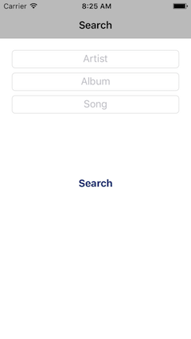
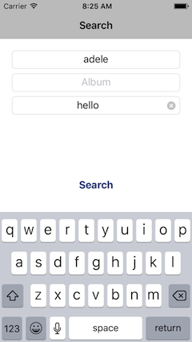
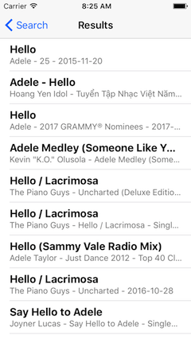
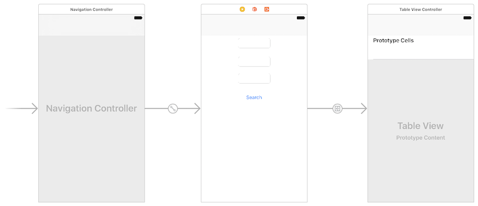

## DPS923 MAP523 Assignment 6 - Query the iTunes Store Web Service

Assignment 6 enables you to begin working with the network, in read-only mode. We will send queries to the iTunes Store web service, and display the results on the device.  
<br>

### Due date
Wednesday, March 15, 2017, at 11:00pm ET  
Grade value: 5% of your final course grade  

*If you wish to submit the assignment before the due date and time, you can do that.*  
<br>

### Objective(s)
Use the network, and a public web service.  
Create an interactive app with a search screen, which will lead to a navigation-based result, with two levels (list, and list-or-detail)  
Continue using the foundation topics from previous classes.  
<br>

### Introduction to the problem that you will solve
We need an app that will enable the user to search the iTunes Store for music, and *display* the results. The app uses the network, so its essential nature is that it will perform its search/fetch and rendering tasks in an asynchronous manner.  

The app's start screen is a data entry screen, and will be managed by a standard view controller. It will enable the user to enter values in one or more text fields. The purpose of this screen will be to gather search terms to be used when querying the iTunes Store web service.  

When the app user taps/selects the "Search" button, a results list (managed by a table view controller) will slide in, and display a list of items that match the search term(s).  

Then, when the app user taps/selects an item on the list, another  screen will slide in:  
* If the item is a song, a standard details view will appear  
* Alternatively, if the item is an album, a list will appear (managed by a standard view controller)  
<br>

> Notice - We plan to post a few more screen shots by mid-day Friday, March 10 (and then we'll remove this notice)  

<br>

<kbd></kbd>&nbsp;&nbsp;<kbd></kbd>&nbsp;&nbsp;<kbd></kbd>  
<br>

### Getting started
Get (download) the WebServiceModel app, which is in the GitHub repo. (Its path is notes/Project_Templates.) 

Follow the instructions in its [Readme.txt](https://github.com/dps923/winter2017/blob/master/notes/Project_Templates/WebServiceModel/Readme.txt), to create an iOS app named **MusicFinder**.  

Show the "projects and targets list", and select the project. Verify that the iOS Deployment Target is set to version 9.0, so that the app will work with all modern/typical devices.  
<br>

#### Verify that the app runs  
First, run the app in the iOS Simulator, so that you know that it does successfully run. It will display a list of academic programs offered by the School of ICT, because that's what the project template does, by default. We will replace that functionality with our own.  
<br>

#### App cleanup
There will be several cleanup tasks, but we'll do them later. Why? We want to leave the project template code bits in the project, until we have added replacements. That way, your app can be built incrementally, and it will still run successfully.  

The project includes a Core Data stack. We will not be using it in this Assignment 6. 
<br>

#### Task preview
In the sections that follow, you will perform these tasks:  
1. Visualize the storyboard  
2. Add new view controllers  
1. (to be determined)  
2. (to be determined)  
<br>

### Visualize the storyboard configuration
(more to come)  
<br>

#### Clean up the existing storyboard
The existing storyboard, as provided in the project template, has three assets on it:  
1. Navigation controller object  
2. Table view scene  
3. Standard view scene  

We do not need numbers 2 and 3. So, delete them, leaving only the navigation controller.  
<br>

#### Do an initial configuration of the storyboard
After you complete this section, your storyboard will look similar to the following:  

  
<br>

As described above, the app's start screen is a data entry screen. So, add a view controller. Position it to the right of the navigation controller.  

> We will configure its custom class (controller) later/soon.  

Add three text fields to the top area of the scene. 

> We will configure some more properties of the text fields later/soon.  
Add a button to the view, located below the text fields. Configure its visible text to be "Search".  

> We will configure an outlet for it later/soon.  

Next, click/select the navigation controller. Add a segue to the new view controller; it will be a Relationship Segue > root view controller.  

As described above, when the app user taps/selects the "Search" button, a results list will slide in. So, add a table view controller to the storyboard. Position it to the right of the just-added view "search" controller. 

> We will configure its custom class (controller) later/soon.  
> We will also configure its prototype cell later/soon.  

Next, click/select the button on the "search" view controller. Add a segue to the new table view controller; it will be an Action Segue > Show.  

> Yes, we can do this. A button tap can trigger a segue. It does not have to be tied to an action.  

Later, we will return to the storyboard, and configure additional scenes.  
<br>

### Create a controller for the "search" scene  
In this section, you will create a *new* view controller, which will display a list of Program objects. The contents and layout of the new controller will be similar to the ExampleList controller that's included in the project template.  

There are a number of programming tasks that must be done:  
1. Create the new controller class  
2. Configure it for use with Core Data and our app architecture (in other words, the Model class)  
3. Write the initialization code  
4. Write the code that will render the data in the table view  
<br>

#### Create the new controller class  
In/under the Classes group, create a new Cocoa Touch Class. It will be a subclass of UITableViewController (right?). Name it "ProgramList" (for consistency).  
<br>

#### Configure it for use  
Before the class declaration, add another import statement, `import CoreData`.  

Next, study the ExampleList controller code. Use its code and organization as an example of how you should write code for ProgramList. It will need properties to hold a reference 1) to the model, and 2) to its frc.  
<br>

#### Write the initialization code  
In `viewDidLoad()`, initialize the frc, using the pattern that you see in the ExampleList controller.  
<br>

#### (app delegate fix) (storyboard fix/config)  
You have probably seen enough code examples to observe that the table view rendering code is done with several functions, and each is responsible for a specific task. (Remember, these functions are called by the iOS runtime as it is preparing to show the view on the screen.)  

In a table view controller that uses our app architecture, we typically use four functions. Study the ExampleList controller, and then write the code for these functions in ProgramList:  
1. Number of sections in table view  
2. Number of rows in a section  
3. Define the cell for the row at an index path  
4. Configure cell contents  

You will learn that the code for the first three functions is the same for all table view controllers. 

> Well, *almost* all.  
> When used with an frc, the first two will get their return values from the frc.  
> Alternatively - as you have seen before - when used with a collection (like an array), they get their return values from hand-coded values and the size (item count) of the collection (array).  

Only the function that actually configures the cell contents differs as different entity objects are rendered.  

For this assignment, we will be using a new-to-you table view cell style (named "Subtitle"), so the cell configuration function will do *three* tasks (not just two):  

```swift
// from the frc, extract the item that we want at the current index path
// configure the cell's text label
// new - configure the cell's detail text label
// configure the cell's image view
```

As you can see, you will configure the cell's image view. Use the technique that you learned in a previous assignment to import the icon images (in the Assignment5Data.zip file) into the app's asset catalog. Notice the name of the icon/image files - they should match the value that you used for the "credential" attribute when you created starter data.  

At this point in time, you can remove code or comments that will not be needed. However, maybe keep the `prepare(for segue: sender:)` function, because we'll code that later (but soon).  
<br>

#### Test your work
At this point in time, the app should enable three-level navigation.  
<br>

### Clean up the project  
Now it's time to clean up the project (more to come).  

Reminder about the recently-learned project "clean" task: If you attempted a build/compile/run right now, it is likely that there would be an error (and that error's message isn't really helpful). The reason is due to the cleanup that we just did. Therefore, we can "clean" the project of any past compilation assets, and start anew. How?  

On the Xcode Product menu, there is a Clean option (with keyboard shortcut Command+Shift+K). Choose/run it.  

Then, build/compile (Command+B). It should be successful now. 
<br>

### Test your work
Run the app on the iOS Simulator, using different devices (that have different screen sizes):  
1. iPhone SE or 5 (4-inch screen)  
2. iPhone 7 (4.7-inch screen)  
3. iPhone 7 Plus (5.5-inch screen)  

Make sure that the content lays out nicely, in portrait mode, on all of these screen sizes.  
<br>

#### Borrowing a device
If you have an iOS device, great, please use it in this course. 

If you do not have an iOS device, the School of ICT has a limited supply of iPod touch devices available for loan. Contact Professor McIntyre to request a device.  
<br>

#### Show / prove that your app works
Final testing of your app must be on a device. Then, take a screenshot of **each** scene (list, list, and detail). 

Screenshots can be taken:
- on the device itself
- using the Xcode Devices window (on the Window menu), you can use the "take screenshot" button, and it will be stored on the desktop.
- in the Simulator, File>Screenshot, it will store the file on the desktop

Submit **all three** screenshots with your project. Put them in the project folder, before doing the zip task.  
<br>

### Submitting your work
Follow these instructions to submit your work:  
1. Make sure your project works correctly  
2. Locate your project folder in Finder  
3. Right-click the folder, and choose **Compress "(project-name)"**, which creates a zip file (make sure the zip file is fairly small, around 1MB or less)  
4. Login to Blackboard/My.Seneca, and in this course's Assignments area, look for the upload link, and submit your work there  
