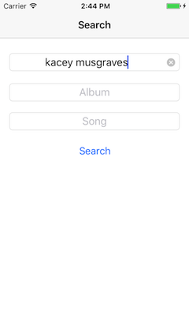
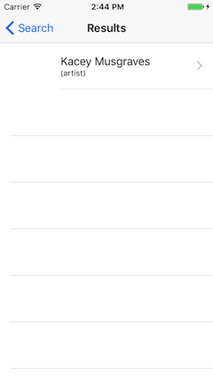
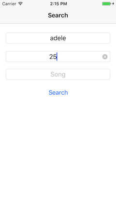
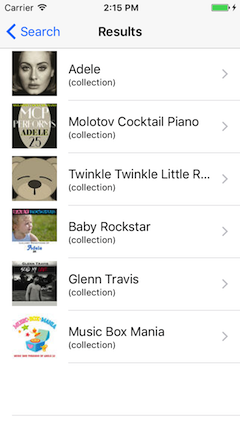
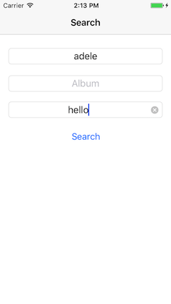
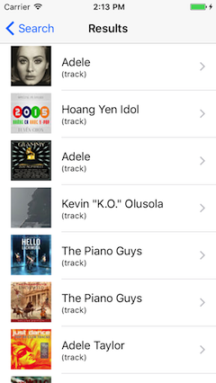
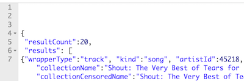
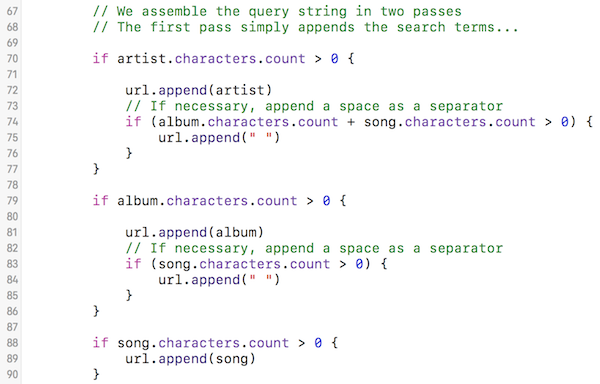
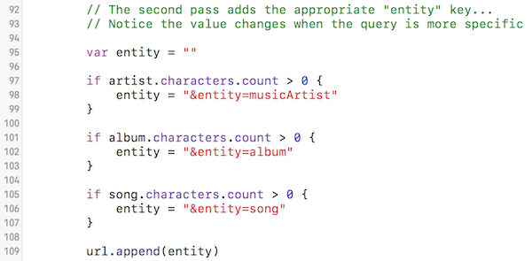

## DPS923 MAP523 Assignment 6 - Query the iTunes Store Web Service

Assignment 6 enables you to begin working with the network, in read-only mode. We will send queries to the iTunes Store web service, and display the results on the device.  
<br>

### Due date
Wednesday, March 15, 2017, at 11:00pm ET  
Grade value: 5% of your final course grade  

*If you wish to submit the assignment before the due date and time, you can do that.*  
<br>

### Objective(s)
Use the network, and a public web service.  
Create an interactive app with a search screen, which will lead to a navigation-based result, with two levels (list, and detail)  
Continue using the foundation topics from previous classes.  
<br>

### Introduction to the problem that you will solve
We need an app that will enable the user to search the iTunes Store for music, and *display* the results. The app uses the network, so its essential nature is that it will perform its search/fetch and rendering tasks in an asynchronous manner.  

The app's start screen is a data entry screen, and will be managed by a standard view controller.  

<kbd></kbd>  
<br>

It will enable the user to enter values in one or more text fields. The purpose of this screen will be to gather search terms to be used when querying the iTunes Store web service.  

When the app user taps/selects the "Search" button, a results list (managed by a table view controller) will slide in, and display a list of items that match the search term(s).  

Then, when the app user taps/selects an item on the list, another  screen will slide in, a standard details view.  

Search artist only:  

<kbd></kbd>&nbsp;&nbsp;<kbd></kbd>&nbsp;&nbsp;<kbd></kbd>  
<br>

Search artist and album:  

<kbd></kbd>&nbsp;&nbsp;<kbd></kbd>&nbsp;&nbsp;<kbd></kbd>  
<br>

Search artist and song:  

<kbd></kbd>&nbsp;&nbsp;<kbd></kbd>&nbsp;&nbsp;<kbd></kbd>  
<br>

### Getting started
Get (download) the WebServiceModel app, which is in the GitHub repo. (Its path is notes/Project_Templates.) 

Follow the instructions in its [Readme.txt](https://github.com/dps923/winter2017/blob/master/notes/Project_Templates/WebServiceModel/Readme.txt), to create an iOS app named **MusicFinder**.  

Show the "projects and targets list", and select the project. Verify that the iOS Deployment Target is set to version 9.0, so that the app will work with all modern/typical devices.  
<br>

#### Verify that the app runs  
First, run the app in the iOS Simulator, so that you know that it does successfully run. It will display a list of academic programs offered by the School of ICT, because that's what the project template does, by default. We will replace that functionality with our own.  
<br>

#### App cleanup
There will be several cleanup tasks, but we'll do them later. Why? We want to leave the project template code bits in the project, until we have added replacements. That way, your app can be built incrementally, and it will still run successfully.  

The project includes a Core Data stack. We will not be using it in this Assignment 6. 
<br>

#### Task preview
In the sections that follow, you will perform these tasks:  
1. Visualize the storyboard  
2. Add a "search" controller (initial easy configuration)  
3. Learn to use the iTunes API  
4. Implement the search controller  
5. Add a table view controller to hold the results  
6. Begin to use the network (web service), and update the search and list controllers  
7. Add a standard view controller to show media detail  
8. Add "artwork" images  
<br>

### Visualize and then partially configure the storyboard  
The storyboard in the project template enables the app to run successfully, but it will not be suitable for our use. In this section, you will learn how to modify the storyboard.    
<br>

#### Clean up the existing storyboard
The existing storyboard, as provided in the project template, has three assets on it:  
1. Navigation controller object  
2. Table view scene  
3. Standard view scene  

We do not need numbers 2 and 3. So, delete them, leaving only the navigation controller.  
<br>

#### Do an initial configuration of the storyboard
After you complete this section, your storyboard will look similar to the following:  

  
<br>

As described above, the app's start screen is a data entry screen. So, add a view controller. Position it to the right of the navigation controller.  

> We will configure its custom class (controller) later/soon.  

Add three text fields to the top area of the scene. 

> We will configure some properties of the text fields, and outlets, later/soon.  

Add a button to the view, located below the text fields. Configure its visible text to be "Search".  

> We will configure an outlet for it later/soon.  

Next, click/select the navigation controller. Add a segue to the new view controller; it will be a Relationship Segue > root view controller.  

As described above, when the app user taps/selects the "Search" button, a results list will slide in. So, add a table view controller to the storyboard. Position it to the right of the just-added view "search" controller. 

> We will configure its custom class (controller) later/soon.  
> We will also configure its prototype cell later/soon.  

Next, click/select the button on the "search" view controller. Add a segue to the new table view controller; it will be an Action Segue > Show.  

> Yes, we can do this. A button tap can trigger a segue. It does not have to be tied to an action.  

Later, we will return to the storyboard, and configure additional scenes.  
<br>

### Create a controller for the "search" scene  
In this section, you will create a *new* view controller, which will display a list of Program objects. The contents and layout of the new controller will be similar to the ExampleList controller that's included in the project template.  

There are a number of programming tasks that must be done:  
1. Create the new controller class  
2. Configure it for initialize/load, and for use with the model class  
3. Configure it in the app delegate and the storyboard  
<br>

#### Create the new controller class  
In/under the Classes group, create a new Cocoa Touch Class. It will be a subclass of UIViewController (right?). We suggest that you name it "MediaSearch".  
<br>

#### Configure it for use  
Next, study the ExampleList controller code. Notice that it has a reference to the model class. Do the same for the MediaSearch controller.  

In viewDidLoad(), set/configure the scene's title property with something (like "Search music").  
<br>

#### Fix the app delegate startup method  
In the application(didFinishLaunchingWithOptions) function, it has code that passes the model object reference to the ExampleList controller.  

Change the code so that it passes the reference to the MediaSearch controller.  
<br>

#### Fix the storyboard  
Now that we have the MediaSearch controller created and partially configured, fix the "search" scene on the storyboard. Set its custom class to MediaSearch.  
<br>

#### Test your work
At this point in time, the app should load, and show the "search" scene. It will not have any functionality yet, but it should load.  
<br>

### Learn how to use the iTunes Store web service
The iTunes Search API (web service) enables you to search for content within the iTUnes Store, App Store, iBooks Store, and Mac App Store.  

[Here is a link](https://affiliate.itunes.apple.com/resources/documentation/itunes-store-web-service-search-api/) to its documentation. The text below will get you started, but you will need to read/scan the documentation to get full value out of the API.  

As you learned in the Week 8 Monday notes and class, it is an open web service, and does not require a developer key for casual use. Specifying a resource URL that begins with  
```
https://itunes.apple.com/search?parameterkeyvalues  
```
will return plain-text JSON results.  

Notice that the results are in a JSON object. (You know this because the results begin with a **{** curly brace.) Most web services will return collection results as an array value of one of the top-level object's properties (keys). 

  
<br>

You must inspect the response, to determine where the collection is. In the iTunes API results, there is a "results" key/property, with an array (collection) of items as its value. The name of the "results" key/property MUST be used as the value of the "dataKeyName" argument when you create a new web service request object. Otherwise, the code will not know where the collection is, and will return an error similar to the following:  

```
Could not cast value of type NSDictionary to NSArray.
```  
<br>

#### Searching for music
We want to enable the user to search for music. We will enable them to enter search terms, for at least one, but maybe any of:  
* Artist  
* Album  
* Song  

There are seven (7) kinds of queries that are possible:  
* Any one search term (3 possible)  
* Any two search terms (3 possible)  
* All three search terms

For example:  

**Any one**

Artist - yes  
Album - no  
Song - no  
All works by the artist   
https://itunes.apple.com/search?term=the+rolling+stones&limit=15  

> The "limit" key is not required. It is used here to simply make the result set smaller.  

Artist - no  
Album - yes  
Song - no  
A specific album   
https://itunes.apple.com/search?term=same+trailer+different+park&entity=album  

Artist - no  
Album - no  
Song - yes  
A specific song (from any artist on any album)  
https://itunes.apple.com/search?term=under+my+thumb&entity=song  

**Any two**

Artist - yes  
Album - yes  
Song - no  
A specific album by the artist  
https://itunes.apple.com/search?term=the+rolling+stones+exile+on+main&entity=album&limit=15  

Artist - no  
Album - yes  
Song - yes  
A specific song on a specific album  
https://itunes.apple.com/search?term=hot+rocks+under+my+thumb&entity=song  

Artist - yes  
Album - no  
Song - yes  
A specific song by an artist  
https://itunes.apple.com/search?term=rolling+stones+under+my+thumb&entity=song&limit=25  

**All three**

Artist - yes  
Album - yes  
Song - yes  
A specific song on a specific album by the artist  
https://itunes.apple.com/search?term=the+rolling+stones+hot+rocks+thumb&entity=song  
<br>

**Summary**  

Notice that an artist query term is the most general, and it does not need the "entity" key in the query string. However, we WILL add "entity=musicArtist" to the query string, to improve the quality of the search results.  

An album query term is more specific, and adds "entity=album" to the query string.  

The most specific is a song query term. When present, it adds "entity=song" to the query string (even when an album query term is present).  

We will use this knowledge later, when assembling the query string.  
<br>

#### Identifiers
As you would expect, all data items have identifiers. Two common identifiers that you will see include artistId and collectionId (for the album). Here's some more information:

To extract the collectionId, which is the album identifier  
"artistId":275557, "collectionId":251792623  

Info about the artist  
https://itunes.apple.com/lookup?id=275557  

Info about the album  
https://itunes.apple.com/lookup?id=251792623    

Songs on an album  
https://itunes.apple.com/lookup?id=251792623&entity=song  

Songs by an artist  
https://itunes.apple.com/lookup?id=275557&entity=song&limit=25  
<br>

#### Wrapper types
Values in the results are organized in a certain way. For example you would expect a "song" query to include just the info about that song. Alternatively, you would expect an "album" query to include a *collection* of song items.  

We will use wrapper type values to determine what scene to show after an item is tapped/selected from a list-of-results scene (table view). Here's some more information:  

wrapperType = artist  
artistId = (a number)  
artistName = ADELE  
primaryGenreName = Pop  
artistLinkUrl = (link)  

wrapperType = collection  
collectionId = (a number)  
artistName = ADELE  
collectionName = 21  
releaseDate = (a date)  
primaryGenreName = Pop  

wrapperType = track  
trackId = (a number)  
artistName = ADELE  
collectionName = 21  
trackName = Rolling in the Deep  
releaseDate = (a date)  
primaryGenreName = Pop  
<br>

#### Interacting with the web service from your computer
A browser can sometimes interact with a web service, but you should really use an HTTP inspector, which is an app that can configure and send HTTP requests, and accept the responses. Then, it enables you to inspect both, and learn about a web service.  

Your professor team recommends that you add the Postman add-in to your Google Chrome browser configuration.  

  
<br>

### Circle back to the search scene and controller
Above, you tested your work, and were able to build, load, and run the app, which showed you the search scene. It's now time to make it work properly.  
<br>

#### Storyboard tasks
Here are some suggestions:  

Each text field should span the width of the scene. Use constraints to do that. Center align. Choose an 18-point font size.  

> Hint - You can select all three text fields at once. Command+click, or lasso. Then, make the changes.  

Add "Placeholder" text to each text field. In case you don't know, the text appears in an empty field, and acts as a hint/guide to the user. It disappears when the user begins to enter text.  

Also, configure the "Clear Button" setting to appear while editing. This will make your user happier.  

Change the button font size to 18, to match the others. 

Select the segue (to the list/table view controller). Give it an Identifier (maybe something like "toMediaList").  

Next, add outlets for ALL FOUR elements (three text fields, and the button). Note that we will NOT need an "action" connection for the button, because the button will trigger the segue.  We WILL need an outlet, so that we can disable the button when the text fields are empty.  

> Why? Think about it...  

Finally, configure the delegate property for each text field, because we will be interested in handling events (text changed, etc.). Reminder (from past assignments and practice work), Control+click+drag from each text field, to the view controller icon in the dock at the top of the view controller scene.  
<br> 

#### Controller code tasks
Above, you just configured the delegate property for each of the text fields. We recommend that you add the UITextFieldDelegate protocol adoption phrase to the controller's class declaration. That will make the methods in the protocol available to Xcode code sense.  

Let's stay with the text fields for a moment. We have an important *user interaction* goal: The "search" button should be active ONLY when there's something in one or more text fields. How are we going to do that?  

Well, we must be able to do two tasks:  
1. Be able to quickly check if the text fields are empty or not  
2. Be able to quickly enable or disable the "search" button  

When? On initial load (or appearance), and whenever the contents of ANY text field changes. 

How? While the language and SDK has ways to determine this, we want to reduce or eliminate repeated code. Therefore, we'll write a few functions.  

First, write a function that will check if the text fields are empty or not. How? Yes, you could write "if" statements, but there are three text fields, and that's not syntax or algorithm design. Let's look for a different way. Here's a question: If the total character count of ALL text fields is zero, then are the text fields empty? Or not?

```swift
// declare a function that will return true or false
// add the character count of all fields
// return true or false, appropriate to your function name 
```

Uh, OK, that's pretty vague. And what's this about the function name? Well, according to the [Swift style guide](https://swift.org/documentation/api-design-guidelines/), "Uses of Boolean methods should read as assertions about the receiver" (the receiver being the thing we're looking at).  

So the advice here is to name the function with a true or false assertion, and code the function body accordingly. The function name could therefore be either one of these general forms:  

```userHasEnteredSearchText``` (or ```doesAnyTextFieldHaveContent```) which would obviously return *true* if the user has entered search text, or  

```areTextFieldsEmpty``` which would obviously return *false* if the user has entered search text.  

Is one better than the other? Your teacher team is pretty neutral on the answer to that. However, we suggest that you look at the intended use: We want to be able to quickly enable or disable the "search" button. Let's look at the properties of a UIButton. Hmmm, there is a boolean property named ```isEnabled```. If true, the button is enabled and usable. Therefore, your teacher team has a slight preference to the first form of function name (something like userHasEnteredSearchText). Why? Easy matching of "true" conditions.  

> Stay with us. We're trying to teach you something here. And prevent crashes due to coding errors due to user interaction.  

At this point, we have task #1 above done (quickly check if the text fields are empty or not). Let's do task #2 now. 

Add a statement to ```viewDidLoad()``` that sets the button's ```isEnabled``` state. That's just safe coding practice.  

Next, write another function, probably named something like ```textFieldDidChange```. It does not need any parameters, and it won't return anything. Its only purpose is to call the function you just wrote above, and use the result to set the button's ```isEnabled``` setting.  

When will this new function be called? Whenever a "text field did change". Does this happen automatically? No - we must configure this. We suggest that you configure this in ```viewDidLoad()```. Here's a typical configuration statement, assuming a placeholder name for the outlet. You will need three of these statements, one for each text field:  

```swift
ui-object-outlet-name.addTarget(self, action: #selector(textFieldDidChange), for: .editingChanged)
```

The addTarget method enables you to handle an event from a user interface control - in this case ```editingChanged``` - with an event handler, which is our new ```textFieldDidChange``` function.  

The value for the "action" parameter is essentially the name of the function that will handle the event. Its syntax is [relatively new](https://swift.org/blog/swift-2-2-new-features/):  

```swift
#selector(name-of-function)
```
<br>

#### Test your work
At this point in time, when the app loads for the first time, the button state is disabled. As soon as one of the text fields has one (or more) characters, the button state should be enabled. Make sure this is happening before you continue.  
<br>

### Add a list (table view) controller to hold the search results
In/under the Classes group, create a new Cocoa Touch Class. It will be a subclass of UITableViewController (right?). We suggest that you name it "MediaList".  
<br>

#### Edit the storyboard
On the storyboard, select the table view. Set its custom class to the new controller "MediaList".  

On its prototype cell settings:  
* Set the reuse identifier value (we've been using "cell")  
* The cell style should be "Subtitle"  
* The accessory should be "Disclosure Indicator"  
<br>

#### Configure it for use  
Return to the MediaList controller code. Next, study the ExampleList controller code. Notice that it has a reference to the model class. Do the same for the MediaList controller. Notice also that it adopts the WebServiceModelDelegate protocol. Do that here too. (When you do, you'll need to copy in the delegate method from the ExampleList controller - do that too.)  

In viewDidLoad(), set/configure the scene's title property with something (like "Search results"). Also, set the table view property's row height to be larger than default, for example, about 70.0. And, configure the model's delegate property to the controller.  

Now... *temporarily* (for testing purposes), we will use a string array to be the data source. (We'll un-do this later/soon.) So, add a property to hold a string array. Its contents will be filled by the MediaSearch controller's ```prepare(forSegue: sender:)``` function.  

Number of sections? 1.  

Number of rows in a section? Return the count of the temporary string array. (You'll change this later/soon.)  

Cell content?  The array element at ```indexPath.row```.  
<br>

#### Code the segue in the MediaSearch controller
We suggest that you configure the segue now, to confirm that it is working correctly. Do this BEFORE working with the network.  

The idea will be to simply gather the text that is entered in the artist, album, and song text fields, and pass them to the list/table view controller, where they will be rendered. For example:  

```swift
override func prepare(for segue: UIStoryboardSegue, sender: Any?) {

    // Temporary array, used to test our logic, will be removed later/soon
    var searchWords = [String]()
        
    // Get the user-entered values, add to the array
    searchWords.append((artist.text?.isEmpty)! ? "(no artist)" : artist.text!)
    searchWords.append((album.text?.isEmpty)! ? "(no album)" : album.text!)
    searchWords.append((song.text?.isEmpty)! ? "(no song)" : song.text!)
        
    let vc = segue.destination as! MediaList
    vc.model = model
    vc.searchWords = searchWords
    }
```
<br>

#### Test your work
Test your work. It should look something like the following:  

<kbd></kbd>&nbsp;&nbsp;<kbd></kbd>  
<br>

### Use the network
At this point in time, the search scene is done, and works. Also, the list-of-results scene works, with temporary data.  

Now it's time to get the network involved.  
<br>

#### Enable the app to send unsecure HTTP requests
Albums have artwork images (in varying sizes). A query result includes URLs to the artwork. Their scheme uses unsecure HTTP. By default iOS apps use only secure HTTPS. Therefore, we must enable the app to send unsecure HTTP requests. 

This is done by adding to the *info.plist* file. Open the file in the Xcode editor. Add a new row, and set its key-value to the following:  

  
<br>

Here's how to do this:  
1. Right-click the top row named "Information Property List, then choose Add Row  
2. A list of choices appear, type and choose "App Transport Security Settings", which adds a dictionary  
3. Click the plus sign to the right of the key name; a list of choices appear, type and choose "Allow Arbitrary Loads", and set its value to YES  
<br>

#### Edit the WebServiceModel class
Study the code in the class. Notice that an array property "programs" is matched to a function "programsGet". We will follow that pattern.  

First, create an array of dictionaries. Why dictionaries? The iTunes API returns JSON results. When your app receives the JSON results, it materializes each JSON object as a Swift dictionary. Keys are always strings, but the values could be strings or numbers (AnyObject). 

Next write a new function that will look similar to ```programsGet()```.  

> FYI, in your teacher team's sample solution, we used the names "media" for the array, and "mediaGet" for the function name.  

The function needs string parameters for artist, album, and song. Just to preview, this function will be called from the MediaSearch controller's ```prepare(for segue: sender:)``` method.  

Here's the algorithm that we'll use in the function:  
1. Define the initial query string  
2. Add the search terms to the query string; artist, album, then song  
3. Add an "entity" key-value to improve the quality of the results  
4. URL encode the query string  
5. Create the web service request  
6. Send it, and process the response  

Here's some more detail:  

**Define the initial query string**  

For best results, the initial query string should be:  
```text
https://itunes.apple.com/search?limit=20&media=music&term=  
```

Notice that we are asking only for "music" media items, and we're limiting the result set to improve performance.  

**Add the search terms to the query string; artist, album, then song**  

Add (append) the incoming search terms to the query string. Do not worry about spaces for now, because we will URL encode them later/soon. We must think about this task in a very specific way:

  
<br>

**Add an "entity" key-value to improve the quality of the results**  

Add (append) an appropriate key-value. This will improve the quality of the results. For example:  

  
<br>

**URL encode the query string**  

Look in the String class for a method that will replace the occurrences of a string with another. We want to replace a space with a plus sign (+).  

At this point in time, our URL is ready, and can be used.  

**Create the web service request**  

Create the web service request object, and set its base URL.  

Before continuing, remove all existing items from the "media" array. We must do this here/now, because the app can be used to send many queries, so we must clear out the old results before sending a new query.  

**Send (execute) it, and process the response**  

The body of the completion handler (closure) will be simpler than the code example that you saw. We will process the results as a collection of dictionaries, so we simply need to get each item as a dictionary [String: AnyObject], and add it to the "media" array.  
<br>

### Update the MediaSearch controller segue
At the present time, the ```prepare(for segue: sender)``` method sends the search terms to the MediaList controller. Now that we have a web service request, let's change the code in the method.  

Comment out the temporary/test code.  

Then, add a statement that calls the web service "mediaGet" method (and passes the search terms as arguments). That's all you should have to do in this controller.  
<br>

### Update the MediaList controller
Some table-building methods need updates. The number of rows in a section is now provided by the model object's count of items in the "media" array.  

In the ```tableView(cellForRow atIndexPath:)``` method, we need to get the array element at indexPath.row (which will be a dictionary object), and extract its artistName value, to use it in the cell's text label.  

While there, we recommend that you set the cell's detail text label to the object's wrapper type.  
<br>

#### Test your work
At this point in time, the app should send a request to the iTunes API, and the results will appear on the table view. If yes, then continue, by creating a "details" view and controller.  
<br>

### Add a MediaDetail controller
In/under the Classes group, create a new Cocoa Touch Class. It will be a subclass of UIViewController (right?). We suggest that you name it "MediaDetail".  

Add a property to hold a dictionary, which will be passed in by the segue method in the presenting controller.  
<br>

#### Update the storyboard
On the storyboard, add a new view controller. Position it just to the right of the other three boxes. Set its custom class value to MediaDetail.  

From the table view's prototype cell, add a segue to the new view controller. 

What user interface objects should we use? Let's keep it simple - add a label, which will be used for the name of the artist or album or song. And, add a text view, which will accept and display multiple lines of text. (Un-check/clear its editable behaviour check box. We do NOT want users to edit the content.)  

> FYI - We can add line breaks ```\n``` to the text that appears in a UITextView. This will be useful to us when we display details.  

Now, create outlets for the label and text view.  
<br>

#### Back in the controller, update viewDidLoad()
In the ```viewDidLoad()``` method, we will configure the label and text view. The content of these will be different, depending on whether the incoming item is an artist, album, or song.  

We can determine this by looking at the value of the wrapperType key in the dictionary. Then, use a Swift "switch - case" statement to handle the different scenarios:  

**"artist" case:**  
Label - artist name  
Text view - artist identifier, and primary genre name  

**"collection" case:**  
Label - album name  
Text view - album identifier, artist name, date released, and primary genre name  

**"artist" case:**  
Label - artist name  
Text view - artist identifier, and primary genre name  

> Hint - The appearance of the date text can be improved...  
> It's weird syntax, but here goes (assuming that "rd" has the "releaseDate" text):  
> ```rd = rd.substring(to: rd.index(rd.startIndex, offsetBy: 10))```

<br>

#### Update the segue method in the MediaList controller
Add code to the segue method that will:  
1. Get the current/selected row number  
2. Get the appropriate item in the array  
3. Initialize the MediaDetail view controller  
4. Pass on the item  
5. Configure a title for the new view controller  
<br>

#### Test your work
At this point in time, the user should be able to tap/select an item in the table view, and the details should appear on its own scene.  
<br>

### Add "artwork" images
We can make one more improvement to the list-of-results on the scene managed by the MediaList view controller: We can add "artwork" images.  

Each album and song object includes URLs to artwork. Our table view row height is 70 points, so let's use the artwork that's sized to fit.  

Each image gets fetched as a separate HTTP request. We will not use the web service request class to do this task. Instead, we will use a *best practice* method for getting images. This is a very common use case, and offers the best performance.  

First, we must create a "placeholder" image. Use the Paintbrush program on a Mac to create a 60px square image, with a white background colour. Then, save it as a PNG. Finally, import it into the app's asset catalog. 

Next, add more code to the MediaList method that configures the cell. First, we will configure the cell's image with the image from the asset catalog. Then, we will request the image from the web. When - or if - it arrives, it will replace the placeholder image. We have decided just to give you the code, as a best practice:  

```swift
cell.imageView?.image = UIImage(named: "mediaPlaceholder")
        
if let artworkUrl = data["artworkUrl60"] {

    let url = URL(string: artworkUrl as! String)
            
    let session = URLSession(configuration: URLSessionConfiguration.default, delegate: nil, delegateQueue: OperationQueue.main)
    let request = NSURLRequest(url: url!)
    let task: URLSessionDataTask = session.dataTask(with: request as URLRequest, completionHandler: {
        (data, response, error) in
                
        if let data = data {
            let image = UIImage(data: data)
            cell.imageView!.image = image
            cell.setNeedsLayout()
        }
    })
            
    task.resume()
}

```  

At this point in time, the artwork images should appear in the table view.   
<br>

### Test your work
Run the app on the iOS Simulator, using different devices (that have different screen sizes):  
1. iPhone SE or 5 (4-inch screen)  
2. iPhone 7 (4.7-inch screen)  
3. iPhone 7 Plus (5.5-inch screen)  

Make sure that the content lays out nicely, in portrait mode, on all of these screen sizes.  
<br>

#### Borrowing a device
If you have an iOS device, great, please use it in this course. 

If you do not have an iOS device, the School of ICT has a limited supply of iPod touch devices available for loan. Contact Professor McIntyre to request a device.  
<br>

#### Show / prove that your app works
Final testing of your app must be on a device. Then, take a few screenshots that shows/proves that your app works.  

Screenshots can be taken:
- on the device itself
- using the Xcode Devices window (on the Window menu), you can use the "take screenshot" button, and it will be stored on the desktop.
- in the Simulator, File>Screenshot, it will store the file on the desktop

Submit the screenshots with your project. Put them in the project folder, before doing the zip task.  
<br>

### Submitting your work
Follow these instructions to submit your work:  
1. Make sure your project works correctly  
2. Locate your project folder in Finder  
3. Right-click the folder, and choose **Compress "(project-name)"**, which creates a zip file (make sure the zip file is fairly small, around 1MB or less)  
4. Login to Blackboard/My.Seneca, and in this course's Assignments area, look for the upload link, and submit your work there  
