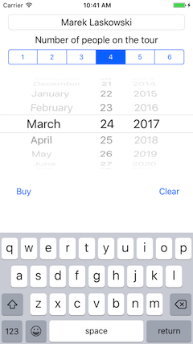
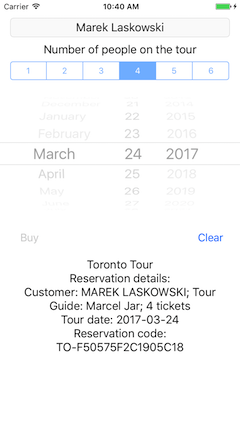
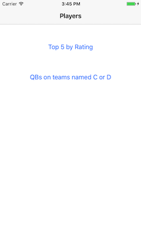
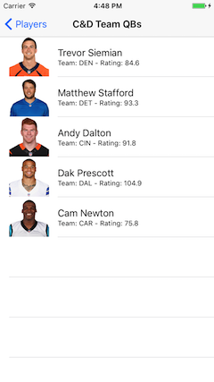
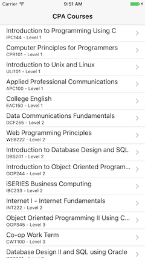
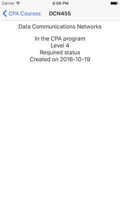
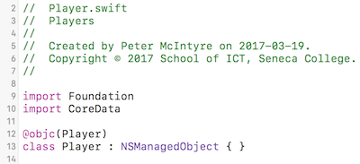
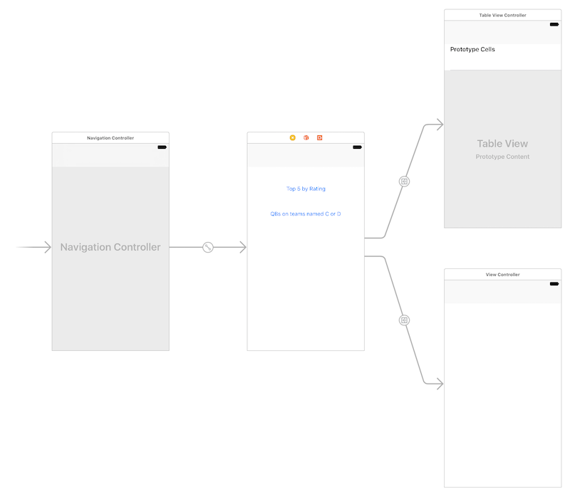

## DPS923 MAP523 Assignment 7 - Fetch, load, query

Assignment 7 enables you to continue working with the network and Core Data, separately and/or together. Three separate small apps will enable you to get experience with some common mobile app patterns.  
<br>

### Due date
Wednesday, March 22, 2017, at 11:00pm ET  
Grade value: 5% of your final course grade  

*If you wish to submit the assignment before the due date and time, you can do that.*  
<br>

### Objective(s)
Use the network, and a public web service.  
Save data (from a plist file, and from the network) into a Core Data store.  
Round-trip data, over the network, to a web service.  
Implement differently-configured fetch requests to query a Core Data store.  
Continue using the foundation topics from previous classes.  
<br>

### Introduction to the problem that you will solve
In this assignment, you will create three separate small apps. Each will enable you to learn and get experience in a common mobile app interaction and data-handling pattern.  

(Your teacher team decided that it was better to do three separate small apps, instead of attempting to create an all-in-one app scenario.)  
<br>

**App 1 - Plan Tour**: Enable a user to make reservations for a full-day tour of Toronto. Data is sent to a web service, which processes the data and returns a response that confirms the reservation.  

<kbd></kbd>&nbsp;&nbsp;<kbd></kbd>  
<br>

**App 2 - Players**: Load the NFL quarterback player data into a Core Data store (on first run of the app). Then, support querying, using *fetch request* objects.  

<kbd></kbd>&nbsp;&nbsp;<kbd></kbd>&nbsp;&nbsp;<kbd></kbd>  
<br>

**App 3 - Courses**: Loads School of ICT academic course data into a Core Data store (on first run of the app). Then, support querying, using a *fetch request* object.  

<kbd></kbd>&nbsp;&nbsp;<kbd></kbd>  
<br>

### App 1 - Plan Tour
Get (download) the new *CombinedModel* app, which is in the GitHub repo. (Its path is notes/Project_Templates).  

Follow the instructions in its Readme.txt, to create an iOS app named **PlanTour**.  

> IMPORTANT!  
> The WebServiceRequest.swift source code file was updated again to add support for the HTTP POST and PUT methods.  
> If you downloaded the new *CombinedModel* app BEFORE Sunday, March 19, at 11:30am, then you have an old or obsolete version of the WebServiceRequest.swift source code file.  
> Before continuing, replace your existing WebServiceRequest.swift source code file with the new file.  

<br>

#### Verify that the app runs
First, run the app in the iOS Simulator, so that you know that it does successfully run. It will display a list of academic programs offered by the School of ICT, because that's what the project template does, by default. We will replace that functionality with our own.  

#### Task preview
In the sections that follow, you will perform these tasks:  
1. Initial storyboard and controller work  
2. Learning about the web service  
3. Controller work  
4. Model work  
<br>

### Storyboard and controller work
On the storyboard, the existing navigation controller and view controller can be deleted. We will need a single scene, a standard view controller, so you can leave that on the storyboard, if you wish.  

Add a new view controller (Swift) code file to the project. Its name will not matter much, so you can name it "TourHome" or something like that. Adopt the WebServiceRequestDelegate, which means that you will have to copy in the ```webServiceRequestDidChangeContent``` method stub.  

It will need a reference to the model. While you're thinking about this, go and edit the app delegate, and set a reference to this new view controller, instead of the original nav + table view.    

Back on the storyboard, set the custom class to the just-added controller. Also, configure it to be the "initial" view controller.  
<br>

#### UI, outlets and actions
From top to bottom, the scene will have the following user interface objects. Some will need labels (use your judgement).  

Text field (outlet): For the name(s) of the people who want to go on the tour. Set the text and keyboard properties so that data input is not annoying for the user.  

Segmented control (outlet): With 6 segments, and segment titles 1 through 6.  

Date picker (outlet): Date mode (no time).  

Button (action and outlet): For the "Buy" action. We need an outlet so that we can disable/enable user interaction with the button.   

Button (action): For the "Clear" action.  

Text view (outlet): Displays data from the web service response. Disable editing.  
<br>

### Web service
A web service has been configured to listen for tour requests. It is designed to accept a package of data in a HTTP POST request, and respond with synthesized info about the tour.  

The web service resource URL is:  
```
https://ios2017.azurewebsites.net/api/tours
```

It supports HTTP GET, but the response will simply tell you what to send.  

The request must have these settings:
POST method
Content type is application/json
It needs a request with this data, as a JSON object:  
* CustomerName - string, length 2 to 100 characters  
* NumberOfCustomers - integer, ranging from 1 through 6  
* TourDate - string, a valid date in ISO 8601 format (see note below)  

For example:  

```json
{
    "CustomerName": "Garvan Keeley",
    "NumberOfCustomers": 4,
    "TourDate": "2017-03-29T12:00Z"
}
```

The response will include:  
* The three data items in the request, unchanged  
* Id - integer, which is an identifier  
* Message - string, information about the tour  
* ReservationCode - string, a reservation (confirmation) code  
* DateCreated - string, in ISO 8601 format  

Use Postman (or similar) to interact with the web service. Create a request, and send it. The data format is JSON, so write/create a suitable JSON object. Study the response.  
<br>

#### ISO 8601 dates
Many JSON interactions with web services use the ISO 8601 standard for dates and times. At a minimum, it needs a date, and hours and minutes. A full representation needs seconds and detailed time zone information.  

We will use the "minimum" format. For example, the ISO 8601 date format for Friday at noon is:  
```
2017-03-24T12:00Z
```

The date picker's "date" property value is a Swift "Date" type. How can we convert the "Date" value to an ISO 8601 compatible string? With the [ISO8601DateFormatter](https://developer.apple.com/reference/foundation/iso8601dateformatter) class. For example:  

```swift
let isoDateString = ISO8601DateFormatter()
isoDateString.timeZone = TimeZone.current
// Then... use the "isoDateString.string..." method
// to get a string from a Swift "Date" value
```

<br>

### Controller work
There are several tasks to be done.  
<br>

#### Initialization (viewDidLoad())
As you have seen and done before, set this class to be the delegate of the model class.

We must set the allowable dates for the date picker:  
* The minimum allowable date will be tomorrow  
* The maximum allowable date will be two weeks from today  

We cannot set these values in the storyboard's Attribute Inspector. They must be set programmatically here.  

To do date arithmetic in Swift, we use the [Calendar](https://developer.apple.com/reference/foundation/calendar) class. For example, if we have a Date object that represents today, we can create another that represents tomorrow:  

```swift
let now = Date()
let tomorrow = Calendar.current.date(byAdding: .day, value: 1, to: now)
```   
<br>

#### Write code for the Clear method
The purpose of this method is to clear any data in the view, and enable user interaction with the objects on the top part of the scene. (Later, you will learn how to disable user interaction, in the Buy method.)  

The other task that must be done in this method is to dismiss the keyboard. This is done by calling the ```resignFirstResponder``` method on the text field.  
<br>

#### Write code for the Buy method
The purpose of this method is to send the data to the web service, and display the response. During this request-response cycle, the code will disable user interaction with most of the objects on the top part of the scene. The Clear button will remain enabled. 
<br>

**Important tasks to do first**  

One of the first things that you should do is ensure that the user has entered something in the customer name field. If not, just return. (Later, we will learn ways to communicate error info to the user.)  

Then, dismiss the keyboard.  

Next, disable most of the controls. Each has an "enabled" property.  

Finally, get the selected date from the date picker, as an ISO 8601 date string.  

Now you're ready to package the data, and call the web service.  
<br>

**Package the data, call the web service**

Create a Dictionary (string key, any value). Get the data from the user interface objects. The key names MUST match the names shown in the sample JSON request above. And, the value types must match.  

> Note: A Dictionary is a standard packaging format when working with JSON objects and a web service. Request and response.  
> The built-in JSON serializer/deserializer expects to work with Dictionary instances when reading or writing JSON objects.  

The last thing to do is to call the method in the Model class which will interact with the web service.  Let's switch to the Model class now, and write that code.  
<br>

### Model work  
As recently discussed, the Model class (in the CombinedModel app project template) now includes all the bits needed for both Core Data and web service interaction. So, this is where we place our code.  

As before, we ALWAYS add two members to the class, to support interaction with a web service:  
* A property to hold the results of the web service request  
* A method that calls the web service  
<br>

#### Property to hold the results  
As you have learned above, we send a POST request to the web service, with a JSON object. The web service responds with HTTP 201, and a JSON object. Not an array, but a single object.

Therefore, create a Dictionary property (string key, any value) to hold the result.  
<br>

#### Method that calls the web service  
This method can (should) accept a single parameter, which will be a Dictionary (string key, any value). Remember, the controller's "Buy" method will be calling this method eventually, and passing on a Dictionary with the data entered by the user.  

Following the pattern you have seen before, write the code, and add in code for the tasks that are new to you:  
```swift
// Create the web service request object  
// Set the HTTP method to POST  
// Configure the resource URL (do this however you wish, with a separate URL base and path, or all-in-one URL base)  

// Set the message body; the syntax is a bit tricky, because "messageBody" can be any type, but we have an incoming Dictionary object  
// This should work:
request.messageBody = userData as AnyObject?

// Send the request
// The code in the "completion" closure does the following:
// The response is available in the "result" variable, which is an ARRAY of AnyObject  
// Recall from above that the web service responds with a single JSON object  
// It can be found as the first (and only) element of the result array, so extract that (it will be a Dictionary)
// Then, set the just-created property value to the extracted Dictionary  

// Notify the delegate that the web service request did change content  
```  
<br>

#### Go back to finish writing code in the controller "Buy" method  
Now that we have a Model class method to call, return to the controller code, in the Buy method, and add the statement that calls the new Model class method.  
<br>

### App 2 - Players
Get (download) the new *CombinedModel* app, which is in the GitHub repo. (Its path is notes/Project_Templates).  

Follow the instructions in its Readme.txt, to create an iOS app named **Players**.  

#### Verify that the app runs
First, run the app in the iOS Simulator, so that you know that it does successfully run. It will display a list of academic programs offered by the School of ICT, because that's what the project template does, by default. We will replace that functionality with our own.  

#### Task preview
In the sections that follow, you will perform these tasks:  
1. Core Data model and init  
2. Plan the storyboard  
3. Add controllers  
<br>

### Core Data model and initialization  
In this section, a new entity will be added to the Core Data model. Then, the store initializer class "init" method will be modified, to process starter data if the app is being launched for the first time.  
<br>

#### Get the starter data  
In Assignment 4, an app was created to display information about NFL quarterbacks. We will use that data again.  

Get (download) the "Assignment4Data.zip" file from the ["assignment-assets" folder](https://github.com/dps923/winter2017/tree/master/assignments/assignment-assets).  

Add the plist file to your project, using the "add files" task. Import the images, using the asset catalog import task.  
<br>

#### Add a new entity to the Core Data model  
Study the plist data. Create a new entity, with an attribute for each of the property list keys. Data types will include string, integer, and double. For easier coding, configure the numbers (integer and double) as scalar types. For this assignment, it is OK to configure the date fields as strings.  

Configure the entity for code generation: As you have done before, the codegen setting will be "Category/Extension".  

Next, create a new Swift source code file to hold the class declaration stub for the just-added entity. Here's a reminder:  

<kbd></kbd>  
<br>

#### Modify the store intializer init method  
In Assignment 4, [you learned how to](https://github.com/dps923/winter2017/blob/master/assignments/a4-football-players.md#add-and-configure-the-model-class) read a plist file, and load its contents into an array.  

We will do this here. Create a local variable. It does not need to be an enduring property, because after we read the plist data once (and only once), it will create data in the Core Data store, and we will not need to keep the array data.  

Then, go through the array. Remember, the array holds a collection of "any object" objects, without a specified type. During processing, we will treat each as a Dictionary object (string key, any value). Here's the general algorithm:  

```swift
// Cast / convert the current player object to a dictionary
// Create a new Core Data player entity object
// Set its property values to the corresponding values from the dictionary  
// At the end (or after all Core Data player entity objects have been created), save changes  
```  

> Tip: Inside the for loop, if you wanted to, you could print (to the debug output window/panel) the new Core Data object:  
> ```print(newPlayer.description)```  

<br>

#### In the Model class, add the frc bits  
As you have learned, a Core Data entity collection is published in the Model class by using a fetched results controller (frc) property, and a statement in the init method that initializes its value. Do that now.  

It will be useful to have an frc, even if we are not going to use it. It's only a few lines of code, and you need the practice.  
<br>

### Plan the storyboard  
The existing template-provided storyboard must be changed. Leave the navigation controller box, but remove the other scenes.  

Here's what we want to end up with:  

  
<br>

Therefore:  
1. Add a standard view controller scene  
2. Add a segue from the navigation controller to this new scene, it will be a root view controller relationship segue  
3. Add a button, which will be for a "Top 5 by Rating" scene  
4. Add a table view controller scene  
5. Add a segue from the button to this new scene (and give it an identifier)  
6. Add another button, which will be for a "QBs on teams named C or D" scene  
7. Add another table view controller scene
8. Add a segue from the button to this new scene (and give it an identifier)  

Soon, we will return to the storyboard, and configure custom class, and so on.  
<br>

### Add controllers  
We will need three.  
<br>

#### Launch scene  
Add a standard view controller (maybe named "PlayerQuery"). It needs a model property. And a title set in ```viewDidLoad()```.  

Edit the app delegate code, so that this is the new root view controller.  

On the storyboard, set the custom class of the standard view controller that has the buttons.  
<br>

#### Top 5 table view  
Add a table view controller (maybe named "PlayerTop5List"). It needs a model property, and a fetched results controller variable. And a title set. Oh, and maybe make the row height bigger.  

In the ```viewDidLoad()``` method, the same code can be used as in other table view controllers that use Core Data. However, we will be configuring the *fetch request* property of the frc.  

First, set its limit to 5 - we want only the top 5 by rating.  

Next, we need a different sort. If you recall configuring the frc statement in the Model class, you probably specified "player" as the attribute to be sorted (in ascending order). Don't change that.  

Instead, change it in this table view controller method. It's a two-step process:  
1. Remove all existing sort descriptors  
2. Add/append a new one, by rating (remember that you want the top 5)  

Do we need a predicate? No.  

The remaining methods in the table view controller can be coded in a way similar to other Core Data driven table view controllers.  
<br>

#### C and D table view  
Add a table view controller (maybe named "PlayerCDTeamList"). It needs a model property, and an array (of Player) property. And a title set. And a bigger row height.  

This controller will be using an array as a data source, and NOT a frc. The array contents will be returned from a call to a method in the Model class.  

We will configure a *fetch request* object in the ```viewDidLoad()``` method. [As you learned in a recent class](https://github.com/dps923/winter2017/blob/master/notes/week_09/monday.md#more-about-a-standalone-fetch-request-object), we create and configure a fetch request by adding a predicate and sort descriptors.  

We want players from teams with team names that begin with the letters "C" or "D". There's a predicate string condition that will do that. Here's what it looks like, with one known string comparison condition:  

```swift
...(format: "team beginswith[cd] 'c'")
```  
<br>

Notice the single quote marks around the letter 'c'. Also, notice the [cd] option on "beginswith", which enables a case- and diacritic-insensitive search.  

The statement above is not enough to do the job. We need to match an "OR" condition. So, extend the predicate string format above to also look for teams that begin with the letter "D".  

Configure a sort descriptor, to sort by team, ascending.  
<br>

### App 3 - Courses
Get (download) the new *CombinedModel* app, which is in the GitHub repo. (Its path is notes/Project_Templates).  

Follow the instructions in its Readme.txt, to create an iOS app named **Courses**.  

> IMPORTANT!  
> The WebServiceRequest.swift source code file was updated again to add support for the HTTP POST and PUT methods.  
> If you downloaded the new *CombinedModel* app BEFORE Sunday, March 19, at 11:30am, then you have an old or obsolete version of the WebServiceRequest.swift source code file.  
> Before continuing, replace your existing WebServiceRequest.swift source code file with the new file.  

<br>

#### Verify that the app runs
First, run the app in the iOS Simulator, so that you know that it does successfully run. It will display a list of academic programs offered by the School of ICT, because that's what the project template does, by default. We will replace that functionality with our own.  
<br>

#### Task preview
In the sections that follow, you will perform these tasks:  
1. Learn about the web service  
2. Core Data work  

<br>

### Web service  
The School of ICT has a public web service API. One of the entity groupings that is available is the academic programs and courses collections.  

The following resource URLs will deliver useful collections:  
https://ict.senecacollege.ca/api/courses/in/cpa  
https://ict.senecacollege.ca/api/courses/in/bsd  

Send a GET request, and the web service will deliver data in JSON format. Use Postman (or similar) to inspect the response, so that you will know how to design a Core Data entity. Notice that the response is delivered as a JSON array of objects.  
<br>

### Core Data model and initialization  
In this section, a new entity will be added to the Core Data model. Then, the store initializer class "init" method will be modified, to process starter data if the app is being launched for the first time.  
<br>

#### Code cleanup  
Before writing our code, let's disable (or comment out or delete) some code.  

In the store initializer, disable the code that adds the objects for the Example entity.  

In the model class initializer, disable the ```programsGet()``` statement.  
<br>

#### Add a new entity to the Core Data model  
Study the plist data. Create a new entity, with an attribute for each of the property list keys. Data types will include string, integer, and double. For easier coding, configure the numbers (integer and double) as scalar types. For this assignment, it is OK to configure the date fields as strings.  

Configure the entity for code generation: As you have done before, the codegen setting will be "Category/Extension".

Next, create a new Swift source code file to hold the class declaration stub for the just-added entity.  
<br>

#### Add the Model class bits to call the web service  
In the Model class, add a method to call the web service. You can use the existing code as a template or indication of how to write the code. Call the resource URL that matches your program of study (CPA or BSD).  

> We probably do not need a property to hold the results from the call to the web service. Loading the data is a one-time task, and after that, the Core Data store on the device has the data needed for the scenes.    

Reminder, as noted above, the response is delivered as a JSON array of objects. Therefore, the value of the ```dataKeyName``` parameter will be nil.  

Go through the results, and for each item, add a new object in the Core Data store. If you want to see progress in the debug output window/panel, use a print statement at the bottom of the loop:  

```swift
print(newCourse.description)
```  
<br>

#### Call the just-added method  
In the store initializer, call the method that you just completed.  

> We do all data loading at first launch in the store initializer.  

<br> 

#### Test your work  
If you used the print command, it will display each added Core Data object. That can be your goal, before continuing with controller and storyboard work.  

Remember, if the Core Data model is edited/fixed, delete the app from the simulator before attempting to run it again. (Otherwise, it will likely complain.)  
<br>

#### Model work  
After loading the data, we must prepare the model class to work with the Course entity collection of data.  

Add an frc property to the class. Then, initialize its value, consistent with the existing code example.  
<br>

### Controller work, list of courses  
For a change, let's do the controller work before we do the storyboard work. The project template/base already has a good-enough storyboard to start with, so we'll leave it for now.  

Add a new controller to display a list of course objects. Configure it with the standard code that is expected. Assume that we will use the "Subtitle" table view cell style.  
<br>

#### Test your work  
If you wish, go to the storyboard, and change the custom class of the existing table view scene to match this new controller. Verify that the table view cell identifier is correct, and that the cell will use the "Subtitle" style.  

Then, go to the app delegate, and change the identity of the root view controller. Then, the app should run correctly.  
<br>

### Controller work, course detail  
In this section, the task will be a bit different than a typical master > detail interaction. We will create a *fetch request* in the course detail controller, which will fetch the data it displays.  

Begin by adding a new controller to display course details. Configure it with the standard code that is expected.  

Go over to the storyboard, and configure the standard view controller scene with a custom class, and some user interface objects. Maybe a label for the course name, and a text view (not editable) to display course details. Configure outlets. Make sure the segue identifier has a name that you like.  
<br>

#### Learn about a managed object identifier  
In other persistent stores, a unique identifier (often known as a  primary key) is a visible part of the storage schema. Also, it is sometimes assigned by the storage engine. In summary, the unique identifier is typically visible and can be queried.  

Core Data objects have a "managed object identifier" (its class is [NSManagedObjectID](https://developer.apple.com/reference/coredata/nsmanagedobjectid)), which does the same job - it is the unique identifier. However, we cannot see it in the schema. In other words, it's not an attribute that you can inspect in the editor. But we can get to it programmatically.  

In the controller, add another property to hold the object ID.  
<br>

#### In the list controller, write code for the segue  
Now that we know the plan, go back to the list controller.  

Write code for the segue. We will pass on a reference to the model object, and the managed object identifier.  

> In the past, we passed on an entity object. Not this time. We want to give you some experience with a different kind of query plan.  

<br>

#### In the detail controller, write viewDidLoad() code  
In this method, we extract data from the object, and write it to the user interface. How do we get the object? We query the *context*. It has a method that lets us do that. For example:  

```swift
// Assuming "objectId" is the managed object identifier
let course = model.context.object(with: objectId) as! Course
```  

Write code that will display some useful information about the course object. Make sure it works correctly before continuing.  
<br>

#### Replace the functionality with a fetch request  
Save the code that works with the object ID - comment it out.  

Now, we're going to do the same task - query for an object, but this time we'll use a fetch request. Here's how it will work:  

**List controller, segue** - From the tapped item, extract a piece of data that will represent uniqueness. You learned above (when studying the web service) that "CourseId" is the unique identifier of a course *at the web service*. We save that value in the Core Data store, so we can feel confident that it will be unique.  

Pass it on to the detail controller. Obviously, you will need a property in the detail controller to hold the value.  

**Detail controller, viewDidLoad()** - Create and configure a fetch request object. Then execute it. The return result - the matching course object - will be used to update the user interface.  

Test your work to ensure that this query method works correctly.  
<br>

### Test your work
Run the app on the iOS Simulator, using different devices (that have different screen sizes):  
1. iPhone SE or 5 (4-inch screen)  
2. iPhone 7 (4.7-inch screen)  
3. iPhone 7 Plus (5.5-inch screen)  

Make sure that the content lays out nicely, in portrait mode, on all of these screen sizes.  
<br>

#### Borrowing a device
If you have an iOS device, great, please use it in this course. 

If you do not have an iOS device, the School of ICT has a limited supply of iPod touch devices available for loan. Contact Professor McIntyre to request a device.  
<br>

#### Show / prove that your apps work
Final testing of your apps must be on a device. Then, take a few screenshots that shows/proves that your app works.  

Screenshots can be taken:
- on the device itself
- using the Xcode Devices window (on the Window menu), you can use the "take screenshot" button, and it will be stored on the desktop.
- in the Simulator, File>Screenshot, it will store the file on the desktop

Submit the screenshots with your project. Put them in the project folder, before doing the zip task.  
<br>

### Submitting your work
Follow these instructions to submit your work:  

> Note - special instructions, because you will submit all three (3) apps...  

1. Make sure your apps work correctly  
2. Locate each project folder in Finder  
3. Select all three (using click, then Command+click, then Command+click)  
4. Right-click a selected folder, and choose **Compress 3 items**, which creates a zip file (make sure the zip file is fairly small, around 1MB or less)  
5. Login to Blackboard/My.Seneca, and in this course's Assignments area, look for the upload link, and submit your work there  
