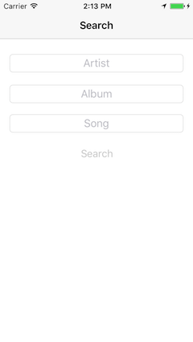

## DPS923 MAP523 Assignment 7 - Fetch, load, query

Assignment 7 enables you to continue working with the network and Core Data, separately and/or together. Three separate small apps will enable you to get experience with some common mobile app patterns.  
 

> This document is being edited.  
> This notice will be removed when the edits are complete.  

 

### Due date
Wednesday, March 22, 2017, at 11:00pm ET  
Grade value: 5% of your final course grade  

*If you wish to submit the assignment before the due date and time, you can do that.*  
 

### Objective(s)
Use the network, and a public web service.  
Save data (from a plist file, and from the network) into a Core Data store.  
Round-trip data, over the network, to a web service.  
Implement differently-configured fetch requests to query a Core Data store.  
Continue using the foundation topics from previous classes.  
 

### Introduction to the problem that you will solve
In this assignment, you will create three separate small apps. Each will enable you to learn and get experience in a common mobile app interaction and data-handling pattern.  

(Your teacher team decided that it was better to do three separate small apps, instead of attempting to create an all-in-one app scenario.)  

**App 1 - Plan Tour**: Enable a user to make reservations for a full-day tour of Toronto. Data is sent to a web service, which processes the data and returns a response that confirms the reservation.  

**App 2 - Players**: Load the NFL quarterback player data into a Core Data store (on first run of the app). Then, support querying, using *fetch request* objects.  

**App 3 - Courses**: Loads School of ICT academic course data into a Core Data store (on first run of the app). Then, support querying, using *fetch request* objects. 

> Screen captures will be posted  

<kbd></kbd>  
 

### App 1 - Plan Tour
Get (download) the new *CombinedModel* app, which is in the GitHub repo. (Its path is notes/Project_Templates).  

Follow the instructions in its Readme.txt, to create an iOS app named **PlanTour**.  

#### Verify that the app runs
First, run the app in the iOS Simulator, so that you know that it does successfully run. It will display a list of academic programs offered by the School of ICT, because that's what the project template does, by default. We will replace that functionality with our own.  

#### Task preview
In the sections that follow, you will perform these tasks:  
1. (more to come)  

Single view app, using a standard view controller  
Gather data from the user on the upper part of the screen  
Text field - the person's name  
Segmented control, 6 segments - the number of people going on the tour  
Date picker - start date is tomorrow, end date is today plus 14 days  
Button - send (HTTP POST) all this content to a web service resource  
Response will include the data entered, plus a reservation number/code, and a date-and-time stamp; display the data on the lower part of the screen  

Also / new:  
Background photo, washed out (translucent)  

     
( more to come )
     

### App 2 - Players
Get (download) the new *CombinedModel* app, which is in the GitHub repo. (Its path is notes/Project_Templates).  

Follow the instructions in its Readme.txt, to create an iOS app named **Players**.  

#### Verify that the app runs
First, run the app in the iOS Simulator, so that you know that it does successfully run. It will display a list of academic programs offered by the School of ICT, because that's what the project template does, by default. We will replace that functionality with our own.  

#### Task preview
In the sections that follow, you will perform these tasks:  
1. (more to come)  

Create a Core Data model that will hold NFL quarterback data  
On first launch, app will open a plist file, and add the contents to the Core Data store  
Nav style app, with a home scene that has two (or three, to be decided) buttons  
One button runs a query (fetch request) that selects the "top 5" quarterbacks by "rating" (sorted)  
The results are displayed on a list (table view controller)  
Another button runs a query (fetch request) that fetches all quarterbacks who play for teams that begin with the letters "C" or "D" (sorted)  
The results are displayed on a list (table view controller)  

URL (use Postman to inspect):  
http://(tba).azurewebsites.net/api/tours  

     
( more to come )
     

### App 3 - Courses
Get (download) the new *CombinedModel* app, which is in the GitHub repo. (Its path is notes/Project_Templates).  

Follow the instructions in its Readme.txt, to create an iOS app named **Courses**.  

#### Verify that the app runs
First, run the app in the iOS Simulator, so that you know that it does successfully run. It will display a list of academic programs offered by the School of ICT, because that's what the project template does, by default. We will replace that functionality with our own.  

#### Task preview
In the sections that follow, you will perform these tasks:  
1. (more to come)  

Create a Core Data model that will hold School of ICT course data  
On first launch, app will call a web service, and add the response/contents to the Core Data store  
Nav style app, with two levels, list scene (table view) and details scene (standard view)  
The list (table view) will show relevant info about courses  
When the user taps/selects a row, the way that we get the data for the details scene *will be different* from what you have learned - we will use the unique object identifier (NSManagedObjectID) to query (fetch request) the Core Data store for the item that we want to display  

URLs (use Postman to inspect):  
https://ict.senecacollege.ca/api/courses/in/cpa  
https://ict.senecacollege.ca/api/courses/in/bsd  

     
( more to come )
     

### Test your work
Run the app on the iOS Simulator, using different devices (that have different screen sizes):  
1. iPhone SE or 5 (4-inch screen)  
2. iPhone 7 (4.7-inch screen)  
3. iPhone 7 Plus (5.5-inch screen)  

Make sure that the content lays out nicely, in portrait mode, on all of these screen sizes.  
 

#### Borrowing a device
If you have an iOS device, great, please use it in this course. 

If you do not have an iOS device, the School of ICT has a limited supply of iPod touch devices available for loan. Contact Professor McIntyre to request a device.  
 

#### Show / prove that your apps work
Final testing of your apps must be on a device. Then, take a few screenshots that shows/proves that your app works.  

Screenshots can be taken:
- on the device itself
- using the Xcode Devices window (on the Window menu), you can use the "take screenshot" button, and it will be stored on the desktop.
- in the Simulator, File>Screenshot, it will store the file on the desktop

Submit the screenshots with your project. Put them in the project folder, before doing the zip task.  
 

### Submitting your work
Follow these instructions to submit your work:  

> Note - special instructions, because you will submit all three (3) apps...  

1. Make sure your apps work correctly  
2. Locate each project folder in Finder  
3. Select all three (using click, then Command+click, then Command+click)  
4. Right-click a selected folder, and choose **Compress 3 items**, which creates a zip file (make sure the zip file is fairly small, around 1MB or less)  
5. Login to Blackboard/My.Seneca, and in this course's Assignments area, look for the upload link, and submit your work there  
