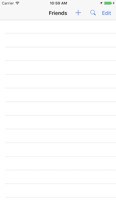
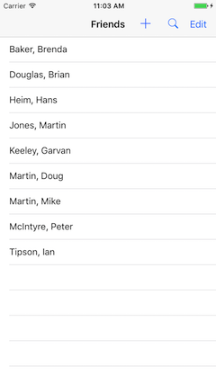
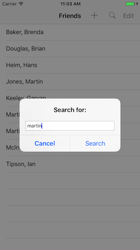
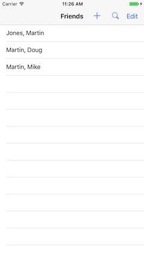
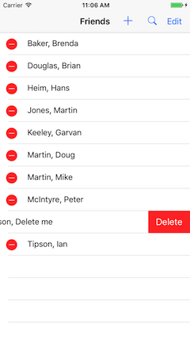

## DPS923 MAP523 Assignment 8 - Core Data Fun
### App with Table View that has live updates from Core Data

Assignment 8 enables you to perform common tasks (add, delete, search) in an app that uses a Core Data store. A table view controller will show live updates, based on user interaction.  
<br>

> This document is being edited.  
> This notice will be removed when the edits are complete.  

<br>

### Due date
Wednesday, March 29, 2017, at 11:00pm ET  
Grade value: 5% of your final course grade  

*If you wish to submit the assignment before the due date and time, you can do that.*  
<br>

### Objective(s)  
Learn common patterns for adding, searching, and deleting data that's stored on the device.  
Continue using the foundation topics from previous classes.  
<br>

### Introduction to the problem that you will solve
This is a non-navigating table view that shows people (friends) on a list. It has buttons for Add, Search, and Edit.  

The app loads with an empty list. There are no objects in the store.<br>
New friends can be added by tapping the plus button ```+``` on the nav bar at the top.  

<kbd></kbd>&nbsp;&nbsp;<kbd></kbd>  
<br>

After adding a number of friends, the list will show them, alphabetically by last name (with a secondary sort by first name).

Notice that when you add each friend, the fetched results controller (frc) will detect the change, run the query again, and the table view will dynamically reload.  

When you load your friends into the app, make sure you add names that will enable the search function to find multiple matching objects. So, friends with the same first and/or last names.  

As noted above, search is supported, as is edit (delete). For example:  

<kbd></kbd>&nbsp;&nbsp;<kbd></kbd>&nbsp;&nbsp;<kbd></kbd>  
<br>

And:  

<kbd></kbd>  
<br>

### Getting started  
Get (download) the *CoreDataModel* app, which is in the GitHub repo. (Its path is notes/Project_Templates).  

Follow the instructions in its Readme.txt, to create an iOS app named **MyFriends**.  
<br>

#### Verify that the app runs
First, run the app in the iOS Simulator, so that you know that it does successfully run. It will display a list of teacher names, because that's what the project template does, by default. We will replace that functionality with our own.  
<br>

#### Task preview
In the sections that follow, you will perform these tasks:  
1. (more to come)  
<br>

#### Design a Core Data model.  

Create a Friend entity with firstName and lastName.

#### Create a table view controller to manage the list of friends.  

The search button is similar to the template code, except you will need to set a new predicate on the frc.<br>
The predicate will find the search string as a case-insensitive and diacritic-insensitive substring in either the first or last name.<br>
Following that, to trigger the frc and the table view to reload with the search results, you will need this block of code:

```swift
        do {
            try frc.performFetch()
        } catch let error as NSError {
            print(error.description)
        }
        tableView.reloadData()
```

If the search string is empty, show all friends.

#### Create a controller to handle the "add" functionality.  

You can do this either as:

* navigation controller Show (a.k.a. Push) segue, or
* a Modal segue

Your choice.

The add dialog must have buttons for:

* adding the friend and returning to the list
* canceling the add and returning to the list

If you want to do a modal segue, the add and cancel button IBActions need to call 

```swift
self.dismiss(animated: true, completion: {})
```

Make sure added friends are saved to disk.

#### Storyboard work:  
Delete the existing detail scene.  

Configure the list scene to work with the new table view controller.  

Make and configure a new "add" scene, it will work with a toolbar button.  

### Screenshots

* Show the friends list with 3 or more rows
* adding a friend
* another screenshot of the friends list after performing the above add
* screenshot of searching for a substring, make sure the search demonstrates that you can search either the first or last name
* screenshot showing the friends list filtered by the above string. 

TIP: If you have a problem getting the search predicate to work for both first and last name searching, just hookup the last name for partial marks.

TIP: Make sure deleting a row works, even though you don't need a screenshot of this. Working fully means that changes are saved to disk.

### Submitting your work
Follow these instructions to submit your work:  

1. Make sure your project works correctly  
2. Locate your project folder in Finder  
3. Right-click the folder, and choose **Compress "(project-name)"**, which creates a zip file (make sure the zip file is fairly small, around 1MB or less)  
4. Login to Blackboard/My.Seneca, and in this course's Assignments area, look for the upload link, and submit your work there  
