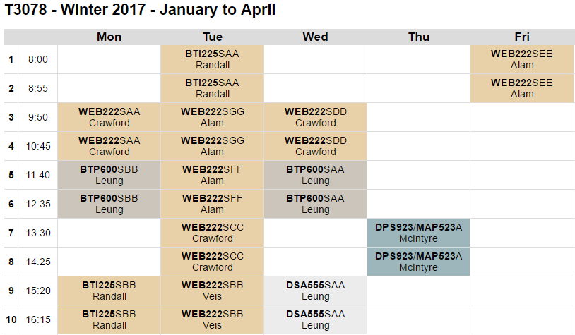
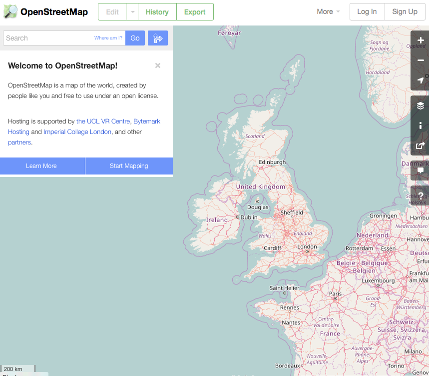

## DPS923 MAP523 Assignment 9 - Location and Maps
Assignment 9 enables you to work with the device's location services, and perform tasks on a map.   
<br>

### Due date
Friday, April 7, 2017, at 12:00pm ET (noon)  
Grade value: 5% of your final course grade  

*If you wish to submit the assignment before the due date and time, you can do that.*  
<br>

```
Special note:  

The College had to change the room access policy for the T3078 computer-lab. It is now locked (and empty) when it does not have a scheduled class.  

How can you make progress on your assignment? Well, if there are available seats, and if you are quiet, non-disruptive, and sit near the back (south end) of the room, you can enter during other scheduled classes on Monday, Tuesday, and Wednesday. Be courteous.  

Here is a T3078 timetable:  
```

  
<br>

### Objective(s)  
Work with Location Services.  
Work with Mapping Services.  
Create an interactive iOS app.  
<br>

### Introduction to the problem that you will solve
We thought it would be a good idea to create a special-purpose app that enables the device user to quickly locate and map *points of interest* near to them.  

Yes, the Maps app can be used for this, but that app is  general-purpose and feature-rich. This app will be a good opportunity to learn how to customize location and mapping to meet a specific need. Location-aware apps are growing in importance in the mobile space, so this will be useful now and into the future.  
<br>

### Getting started  
A *new* project template has been created, and can be found in the [Project_Templates](https://github.com/dps923/winter2017/tree/master/notes/Project_Templates) folder.  

Download *OpenStreetMapModel*, and rename it to "MyMapping", using the project-rename procedure that you have used in the past. 
<br>

#### Verify that the app runs
First, run the app in the iOS Simulator, so that you know that it does successfully run. It will display some restaurants near to a specific location. We will add and replace that functionality with our own.  
<br>

#### Task preview  
In the sections that follow, you will perform these tasks:  
Essentially, the idea will be to replace the hard-coded location with the device's current location.  

Then, show a list of matches for a selected kind/category of nearby locations (restaurants etc.).  

Then, map them (using the native iOS map view), with info-bubbles that give the user more info.  
<br>

#### Learn about another service that delivers map-related data
In this assignment, you will be able to work with the *OpenStreetMap* service. It delivers map-related data, and is a good learning tool, with low use/implementation barriers.  

[OpenStreetMap web site](https://www.openstreetmap.org)  
<br>

  
<br>

### Task sequence  
Clear out the storyboard, we won't use any of the existing scenes.  

Copy the scene with the MKMapView from week 11 WhereAmI into the storyboard, also add this file to your project:<br>
https://github.com/dps923/winter2017/blob/master/notes/week_11/WhereAmI/Classes/MyLocation.swift  

Set the scene you added as the 'Initial View Controller' for the storyboard.  

We won't need the AppDelegate app init code, you can comment that out. This app will just load the map view scene.  

You will change MyLocation didUpdateLocations to only get a _single_ location and then stop updating.  

Using that same function, put the code for searching OpenStreetMaps in there: `let request = WebServiceRequest(); request.osmSearch(...)`, search based on the location received. Use a 5 km radius.  

Change the request.osmSearch(...) response to create Pin objects. Set the pin name and detail, and add to the map with `addAnnotation()`.  

In the calloutAccessoryControlTapped, which is called when the info button on the callout is tapped, output the pin details to the console.  
<br>

### Screenshots
Include a few screenshots that will show the result of a few interactions.    
<br>

### Submitting your work
Follow these instructions to submit your work:  

1. Make sure your project works correctly  
2. Locate your project folder in Finder  
3. Right-click the folder, and choose **Compress "(project-name)"**, which creates a zip file (make sure the zip file is fairly small, around 1MB or less)  
4. Login to Blackboard/My.Seneca, and in this course's Assignments area, look for the upload link, and submit your work there  
