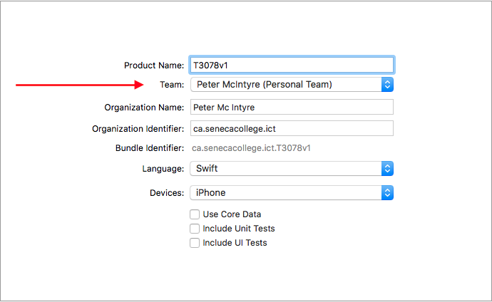
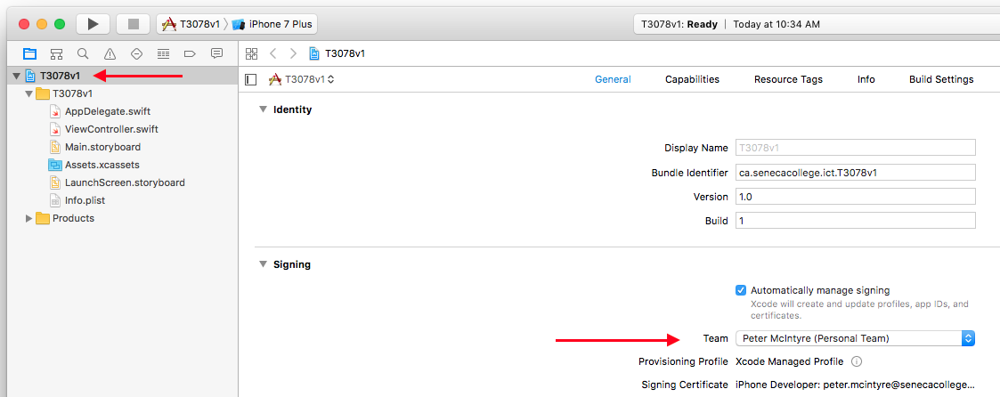
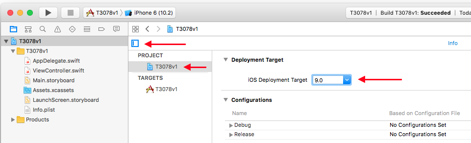
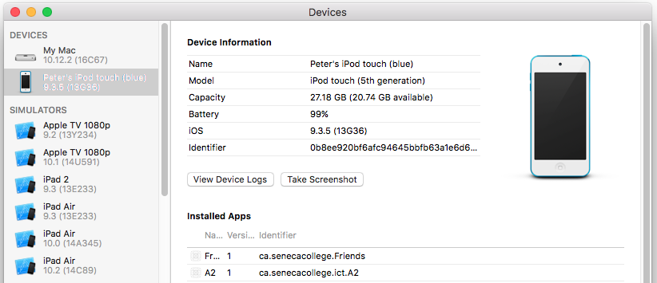

Thursday, January 26, 2017  
Computer-lab room T3078 at 1:30pm  

Agenda for today:  
1. Install/copy app to iOS device
2. Debugging introduction
3. Work on Assignment 2
  

### Install/copy app to iOS device
These instructions will be cleaned up after today's class/session.  

Many students have one or more iOS devices (iPhone, iPad, iPod touch). We can install our apps on these devices, and we will be doing so during the academic term. 

> Do you have an Apple ID? You must have one to install an app on a device. Before continuing, verify your Apple ID (by signing in to an Apple online property), or by [creating a new Apple ID](https://appleid.apple.com/account).

Your device must run iOS version 9 or later. We will configure a setting in each app project (in Xcode) to match this requirement. 

Also, it must be connected to the Internet (wifi or cellular). 

> If you do not have an iOS device, the School of ICT will loan you a device. The loan period is for the duration of the current academic term, and you must return the device by the end of Thursday, April 13, 2017. There is no cost to borrow the device, as long as it's returned, and is in working order. 

There are a few important tasks that must be done before you can install/copy an app to an iOS device.

First, start Xcode. Do NOT open an existing project, or start a new project.  

Instead, open Xcode Preferences (Command+,). On the Accounts panel, add your Apple ID. After adding, you will notice that your name appears on the right side, with a "Personal Team" descriptor.

> Note - Doing this will save your account information on the computer. If you are using a Mac mini in room T3078, then it is *very* important to restart the computer when you're done using it. (When a T3078 computer is restarted, it erases/clears user data, including this kind of account information, as well as browser history, etc.)

Now, you can create a new project. On the dialog, there will be a new drop-down list/field, for the team:

  

When the project loads, we must change some settings. On the main project page, in the "Signing" area, choose your personal team for the "Team" setting.

  

Next, we will change an iOS version setting. We suggest setting it to 9.0, so that your app can run on many versions (and not just on the most recently updated iOS version). 

  

Do some work on your project. In class, we will simply add a Label to the single storyboard scene. Then, run the app on the simulator, and make sure it runs successfully and without errors.  

Now, plug in your iOS device. It will likely display an alert, asking you to "Trust this computer?". Answer yes. 

Next, on the Xcode "Window" menu, choose "Devices". Notice that the new plugged-in device appears on the left side. You can select it, and notice that it is "Processing symbol files" for a couple of minutes. Wait for that to complete.  

  

Next, back on the main Xcode project window, on the device picker, choose your device. Build/compile (Command+B). You will be prompted to allow access to your keychain information. Yes, allow that. 

  

Attempt to run. The first attempt will likely be unsuccessful, and will show you an error dialog. Follow its instructions to change a setting on your iOS device, to allow the app to be "verified" (installed). 

Then, attempt to run it again. It should run successfully from now on. 

### Debugging introduction
( more to come )  
 

### Work on Assignment 2
( more to come )  
