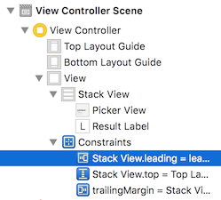
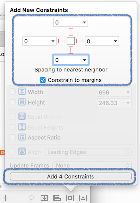
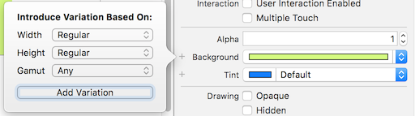
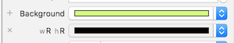
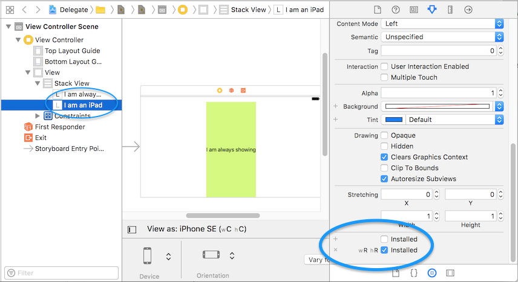

# Auto Layout

Up until now, if you have simply dropped a UIView control (button, slider, text field, etc.) on a Scene in the Storyboard you have placed it using fixed coordinates.
Fixed coordinates are not adaptable to different screen sizes and orientations.
Auto Layout is the name for the iOS rule-based layout system, which uses sets of constraints which you will specify.

> Apple has an [Auto Layout Guide](https://developer.apple.com/library/content/documentation/UserExperience/Conceptual/AutolayoutPG/) that complements today's notes.  
> Read through its "Getting Started" topics. If you can, create a throw-away Xcode project, and follow along with the topics in the guide.

Constraints: rules that specify how UIViews are positioned (i.e. 20 points from the left edge, align the top edge with the top of the superview).

> Tip: the `UIView.superview` is the the name of the containing view, that is, if UIView A's superview is UIView B, then B.subviews contains A. 

Typical constraints will specify:
* the layout of a view within it's superview
* the layout of a view relative to a neighbouring view

## Adding constraints

Constraints are added using the buttons:
* `Pin Tool` -also referred to as `Add Constraints` tool 

* `Align Tool` -also referred to as `Add Alignment Constraints` tool 

* `Resolve Auto Layout Issues` 

Interface Builder can take a best-guess approach at adding constraints by using 
`Resolve Auto Layout Issues>Reset to selected constraints`. 
If you position elements in your view manually, then click this, you will see a bunch of blue lines appear indicating the added constraints. 

This best-guess approach will only work for simple cases, and it is more reliable to manually specify the constraints. 
For quick demo apps, you may find this to be useful. 

If you have specified some, but not all, constraints, you can use 
`Resolve Auto Layout Issues>Add missing constraints`. 
This uses the same best-guess approach to fill in all the required constraints.

### How many constraints are needed for a view?

A UIView needs enough constraints to specify its horizontal and vertical position, and its width and height, so 4 constraints in total. 
However, many UI controls have an `intrinsic size` which is a preferred width and height, and only require 2 constraints for positioning.
A label for instance, will set its `intrinsic size` to a width and height to fit its text, and will use this for width and height constraints if you don't manually specify these.

Read this article https://cocoacasts.com/what-is-intrinsic-content-size/ up to the end of the section `How Does It Work` (you can stop reading at `Conflicts & Intrinsic Content Size`).

## Pin Tool 

The title of this tool panel is `Add Constraints`, and is often referred to by that name.
This button opens a panel that allows you to create constraints by editing fields in the panel and clicking `Add Constraints`. This is not a property viewer panel (you won't use this to view the current constraints, it only for creating/modifying constraints). Created constraints appear in the **Document Outline** for your view.

The `Align Tool` works similarly.

## Constraint Problems 

Constraints appear as blue or orange lines on the Scene. Blue lines mean the constraint has no problems. The constraint turns orange when it is incomplete or conflicting. Also, the View Controller Scene in the **Document Outline** will get an orange arrow you can click to view the constraint problems.

A common situation that will turn constraints orange is when manually moving a UI element after having applied constraints, and the position of the element no longer matches what the constraint is. Instead of locking UI objects in place when you have constraints setup, Interface Builder allows you to move them. However, moving them will turn the constraint orange to indicate you either need to move the UI object back, or update the constraint to the new position.

To fix bad constraints (orange) after moving an element manually:
* To use the new position: `Resolve Auto Layout Issues>Update Constraint Constants` 
[This StackOverflow question shows how to use Update Constraint Constants](https://stackoverflow.com/questions/40323794/how-to-update-frame-in-xcode-8)
* To reset the position to match the existing constraint: `Update Frames` button 
[A StackOverlow answer that illustrates this](http://stackoverflow.com/a/40606477/490488) 

## Viewing and modifying an existing constraint

You can view an individual constraint's properties in the right-side Utilities panel's Size Inspector:
* click the constraint in the **Document Outline** panel on the left (both the Size and Attributes inspectors show the same thing in this case)
* or, click on the constraint line on the Scene view

To view **all** constraints for a view, select the view on the Scene, and click on the Size Inspector in the right-side Utilities panel.

At this point one can edit constraint properties. 

For instance, if a button height constraint was 24 points, and you wanted to make it 30 points, select the constraint using any of the above methods and modify the value.

# Stack Views (UIStackView)

Here is where things get much easier! The button for Stack View layout looks like: 

UIStackView is a layout container for grouping views in a horizontal or vertical rows. 

With views selected on the Scene, click the `Embed in Stack` button. 
If your selected views are arranged horizontally, then they will be grouped into a Stack View with a `horizontal` axis property. And if arranged vertically, the axis property will be set to `vertical`. 

By nesting Stack Views to arrange everything on your Scene, you can avoid using numerous constraints. 

The top-level Stack View in your Scene will require constraints to specify its spacing from the edges of the top-level view.
Typically, this will be pinned to the edges of the top-level view:

[This image](images/constraints-on-top-stackview-full.png) shows more of the screen to show the selection of top-level Stack View (the first subview of the item named `view`) in the **Document Outline** on the left.

Constraints can now be added selectively, for instance to set items to a specific width, or to adjust spacing. 

Please read this short article: http://www.thinkandbuild.it/introduction-to-uistackview/
> TIP: use `Editor>Unembed` to break a stack layout

### Example of using Stack Views to make a grid layout
This is a very common use case, and this post on Stack Overflow illustrates it perfectly:
http://stackoverflow.com/a/36415807/490488

## Configuring Stack Views

Adjusting the layout in a stack view can be done primarily with:
*  `spacing`, `alignment`, `distribution` on the Stack View properties
* `content hugging priority` and `content compression priority` on views in the Stack View

### Spacing
Inter-item spacing is zero by default, which is rarely what you want. 
Use `spacing` to adjust this.

An easy method to add a space between views, is to add a blank UIView (called simply a `View` in Interface Builder's object library), and add constraints for its width and height as needed. 

## Changing how items grow and move

There are two very useful properties for this, and I find them particularly useful to control the behaviour
of items in Stack Views.

##### Content Hugging Priority

This affects how likely a view is to **hug** its content, relative to other views. The higher the number the more likely it is to avoid expanding.
Best explained by example:
> Given 2 labels, we want the first one to fill the available space as the screen size increases, 
so whichever label has the lower value for the `Content Hugging Priority` will grow to fill the space

##### Content Compression Resistance Priority

This property is used for a view to **resist being resized smaller than its content**.
Again this is relative to other views in the layout, and the view with a lower value will
compress before a view with a higher value.

Reference: https://krakendev.io/blog/autolayout-magic-like-harry-potter-but-real

## Margins and Constrain to Margins option

Constraints for position can be relative to the margin of a superview
UIView has a [layoutMargins](https://developer.apple.com/reference/uikit/uiview/1622566-layoutmargins) property to define the margins for the top, bottom, left, and right of a view. 
The default value for this is `(8,8,8,8)`, and it can be changed in code. 

It depends on your interface design whether you want to use this or not, and if you forsee having to adjust the margin. 
You may know up front that your app design will always have views pinned to the edge of the top-level view, in which case you can uncheck this option.
 I recommend using it, as it allows for simple changes of edge spacing.

# Customizing the layout for different devices or orientations:  Size Classes and Vary for Traits

Size Classes are the names for different screen sizes, using a classification system that is more general than specifying exact screen dimensions or device.
The size is described using classes `compact size` and `regular size`, and this is used to describe width and height.

Here is the size classes in a table: [Apple doc on size classes](https://developer.apple.com/library/content/featuredarticles/ViewControllerPGforiPhoneOS/TheAdaptiveModel.html#//apple_ref/doc/uid/TP40007457-CH19-SW4)
 Here is the Apple doc showing the size classes in images: [UITraitCollection](https://developer.apple.com/reference/uikit/uitraitcollection)

The word traits is synonymous with Size Classes, as the `UITraitsCollection` is Swift object that stores the current view state 
of the app by storing the current horizontal and vertical Size Classes.

To customize an app in interface builder for difference screen sizes, there is a button to `Vary for traits`,
which means to enable different layouts (and different views on the layout) for different Size Classes.

## Different layouts for iPad and iPhone

This is the most common use-case. The size classes for iPad are always `Width:Regular, Height:Regular` regardless of orientation, and
no iPhone matches this, so anything customized based on a Size Class / Trait of `Width:Regular, Height:Regular` will be different on iPad vs iPhone.

>PROBLEM: In Interface Builder how do I customize the view for portrait/landscape orientation on iPad? 
Unlike iPhones, the size classes for iPad are always `Width:Regular, Height:Regular` regardless of orientation. 
You would have to do this in code. We won't get into that topic, but here is link to [how it is detected in code](http://stackoverflow.com/a/39655564/490488).

Here is a great demo on Size Classes and Vary for Traits (this info starts at 9 min mark, but the intro is good also): 
https://www.youtube.com/watch?v=7iT9fueKCJM  

### Method 1: `Vary for Traits` button
What is shown in the above demo is how to use the button `Vary for Traits` to add a new UI element for a specific Size Class.
I find the next method easier to use.

### Method 2: `Add customization` (the `+` button) in the Attributes Inspector
Various properties in the Attributes Inspector for a view have a `+` button next them to customize the property for different screen sizes.
Here is an example of changing the background color so that it is green on iPhone and black on iPad:

> Adding the variation for Width:Regular and Height:Regular (which is iPads only):  
>  
>
>And setting the color for this variation to black:  
>

You can show/hide elements using the `installed` property.

> **Example showing the label "I am an iPad" installed only for Width:Regular and Height:Regular,**
> **so it will only show on an iPad, and be hidden on iPhones**
>
> 

# References

There are a lot of links to required readings, so I am repeating them here to make sure you haven't missed any:
* Intrinsic content size: https://cocoacasts.com/what-is-intrinsic-content-size/ up to the end of the section `How Does It Work`
* Overview of Stack View layout: http://www.thinkandbuild.it/introduction-to-uistackview/
* Stack View layouts to make a grid: http://stackoverflow.com/a/36415807/490488
* Hugging and Compression Resistance: https://krakendev.io/blog/autolayout-magic-like-harry-potter-but-real
* "Vary for Traits" button demo: https://www.youtube.com/watch?v=7iT9fueKCJM
* Apple "Auto Layout Guide":
https://developer.apple.com/library/content/documentation/UserExperience/Conceptual/AutolayoutPG/

