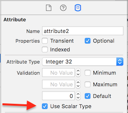
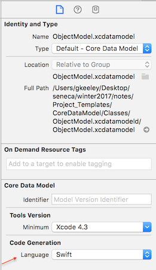
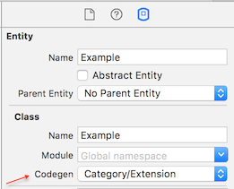

## Introduction to Core Data

Core Data is an object design, management, and persistence framework.

It helps you manage the lifecycle of objects and [object graphs](https://developer.apple.com/library/ios/Documentation/General/Conceptual/DevPedia-CocoaCore/ObjectGraph.html).

It can support different storage formats, but we will use the long-established (since 1994!) and default "SQLite" storage.

Uh oh, SQL you say? Will I be writing SQL code like the following?
```
var person = database.perform("SELECT * FROM person where id = ?", personId)
```
**No**, Core Data has the features of an Object Relational Mapper (ORM) - which is a fancy way of saying you will access the data store
using Swift classes and properties. In other courses, if you were using an SQL database but accessing it using native code and not SQL statements (for example ASP.NET MVC apps that use Entity Framework), then you were using an API that had ORM features.

> **Warning...**  
>
> Now that you know that the backing store format of Core Data is SQLite, please *forget this immediately!*.  
>
> Some authors and reference resources like to compare Core Data concepts and operations with traditional database concepts and operations. We will *NOT* do that here.
>
> Your professors insist that you *MUST NOT* strongly link and/or compare the two technologies, even though you are tempted to do so. Instead, you should learn the fundamental Core Data concepts, and if you have to make comparisons to aid your understanding, then you can do so on your own.
>
> Comparing and/or equating Core Data and relational database management system technologies *is a mistake*.

<br>

Designing a class in Swift, and designing an **entity** in Core Data model editor, are very similar.

A Person class in Swift might look like:
```swift
class Person {
    var firstName: String?
    var lastName: String?
}
```

The Core Data model would have an entity named 'Person'
 and it would have two property attributes named 'firstName' and 'lastName', both of type String.


## How do I get started?

Use a ‘project template’.

In the course GitHub repository, in the [Project_Templates](../Project_Templates) folder, 
you will see a project named **CoreDataModel**.

Make a copy of that, and you will have all you need to get started.

> How do I make a copy?
> The Readme.txt file in the CodeDataModel project helps you do this.

## What’s in the “CoreDataModel” project template?

The project template has all the pieces you need.

It is _nicely organized_.

The project template includes the **Core Data ‘stack’**, 
which provides the necessary objects.

A **store initializer** is included, enabling you to create startup data for the app when launched for the first time.

Its **Model** class is configured for Core Data, and has examples of properties of methods.

And it has a _table view controller_, and a standard _view controller_, which can use Core Data objects.

## Where do I see Core Data in a project?

The following screen shot shows some of the Model class in the CodeDataModel project template. (Click to view it in a new tab/window.)

Look at the following notable items:

*   The CDStack class is created when the Model is initialized
*   The ObjectModel file, which is the Core Data (object) model created by the model editor


## How do I design my entity objects?

Use the [Core Data model editor](https://help.apple.com/xcode/mac/8.0/#/devd12d8e252).

The screen shot below shows an example where two entities were designed. (Click to view it in a new tab/window.)

Look at the following notable items:

*   Add Entity control
*   List of entities that have been designed
*   Add ( + ) and Remove ( – )  properties controls
*   For a selected/highlighted entity, a list of attributes and relationships
*   For a selected/highlighted entity, available settings in the Data Model Inspector (in the right-side Utility area)

[](https://petermcintyre.files.wordpress.com/2014/02/how-to-design-entities.png)
<br>(This is an Objective-C project, but the Core Data editor is same for Swift)

## Attribute Types

Core Data supports many common data types like integers, floats, booleans, String, Date, etc.

Be aware that the generated code for certain attribute types is a Swift optional; most notably,
String attributes are always generated as `String?`.
This an annoyance when using string interpolation, as optional strings will print out like this:
```swift
var str: String? = "hello"
print("Ugly string interpolation: \(str)") 
// prints: Ugly string interpolation: Optional("hello")
```
Use your optional unwrapping skills to solve these cases.

***Handy checkbox: Use Scalar Types***

By default, the code generator for numeric and boolean types is `NSNumber`,
which is a class type that is generalized for number storage, and is inconvenient to use in Swift.
This results in additional type conversion calls in your code.

However, there is a checkbox in the Core Data editor that appears for numeric attributes called
`Use Scalar Type`, which is a convenience feature that will ensure generated code
uses a specific Swift type like Double, Int32, Int64, Bool, etc. 
<br>You don't need to check this off for Date types -generated code will use NSDate by default which is fine.



***Attribute with Optional Type in Core Data Entity***

You can see this Optional checkbox in the above image.
This is not the same as a Swift optional! 

The naming is unfortunate, but you can specify 
whether a type in the Core Data model is 'optional'. By default this is checked on.
If it is off for your entity, and you fail to set a value for this, you will get errors reported in your Core Data stack.
~~The CDStack that is provided is very simple and doesn't handle these errors, so please leave that Optional checkbox on.~~
*The CDStack was updated to report these errors clearly, so go ahead and use non-Optionals. Your app will still abort though if you fail to assign a value.*

A common (and safe) use for this checkbox is when specifying a default value for an attribute, the attribute can also be
set to non-optional.

## Naming conventions

Entity names begin with an upper-case letter. Multi-word names use camel-casing.

Property names – attribute, relationship – begin with a lower-case letter. Multi-word names use camel-casing.

Do NOT use “description” for the name of an attribute.

> Why?
> 
> It’s documented in the [Core Data Programming Guide](https://developer.apple.com/library/mac/documentation/cocoa/conceptual/coredata/articles/cdMOM.html#//apple_ref/doc/uid/TP40002328-SW6), and in the [NSPropertyDescription](https://developer.apple.com/library/mac/documentation/cocoa/Reference/CoreDataFramework/Classes/NSPropertyDescription_Class/NSPropertyDescription.html) class reference document. In summary, DO NOT use these names for properties:
> 
> *   <span style="line-height:1.5em;">description</span>
> *   <span style="line-height:1.5em;">class</span>
> *   entity
> *   objectID
> *   <span style="line-height:1.5em;">self</span>

A “to-one” relationship property name is singular. For example, “supplier”.

A “to-many” relationship property name is plural. For example, “products”.

## Setting up Xcode to generate code for your Entity

In your code, your entity becomes a class.
The class will inherit from NSManagedObject and have property names that match those in the Core Data model. 
You can create this code fully yourself, or you can have Xcode generate the class for you.

We'll use code generation as it ensures that edits in the Core Data model match the NSManagedObject
subclass in your code. This ensures that the changes in the Core Data editor will be kept in-sync with your code.

##### (1) Set Code Generation language to Swift in the Core Data model editor (only need to do this once)


##### (2) Set 'Codegen: category/extension' option in the Core Data model editor for each Entity


This will generate a ``class extension`` in Swift that matches your entity in the editor.
> Extensions add new functionality to an existing class, structure, enumeration, or protocol type.
[Class Extension Documentation](https://developer.apple.com/library/content/documentation/Swift/Conceptual/Swift_Programming_Language/Extensions.html)

The generated code won't show up in your project, however the file looks (roughly) like:
```swift
// auto-generated code, don't change!!!
extension Example {
    @NSManaged public var attribute1: String?
    @NSManaged public var attribute2: Int32
}
```

This would be for an entity named ``Example`` with two attributes named "attribute1" and "attribute2"
with the types String and Int32 respectively.

The file generated in this case is called `Example+CoreDataProperties.swift` and it is possible to 
view it using the Xcode editor's 'Jump to Definition' feature, whereby option-clicking on classes/properties/functions in the code editor will
bring you to the definition. In the code below, option-clicking on example.attribute1 will jump to the 
generated code.

##### (3) Add an empty class declaration in your code 

You will need to add an empty class declaration in your code, or the ``extension`` won't compile. 
An ``extension`` needs a class of the same name to extend. 

The added class is a subclass of NSManagedObject, and for an entity named 'Example' it looks like:
```swift
@objc(Example)
class Example : NSManagedObject {
    // put custom code here if you want
}
```

##### (4) You are done, use the class in your code

In your code, this is how you can create and modify an `Example` object:
```swift
   var example = Example(context: managedObjectContext)
   example.attribute1 = "a thing"
   example.attribute2 = 1234
```

In summary, this codegen setup seems a little odd at first. Why both a ``class`` and an ``extension``? 
It is for independance of the Xcode-generated part, and for the user-modified part.
Your code can go into the ```class Example``` while Xcode can regenerate ```extension Example``` 
without overwriting your changes.
<br>
<br>
> Technical note regarding extensions: an extension can't add non-computed properties to a class; these NSManaged properties are computed properties 
(they are properties that are actually functions). 
I mention this only for completeness, it is not important to understand right now.


## What is a “managed object”?

“NSManagedObject is a generic class that implements all the basic behavior required of a Core Data model object.” (From the [NSManagedObject](https://developer.apple.com/library/mac/documentation/Cocoa/Reference/CoreDataFramework/Classes/NSManagedObject_Class/Reference/NSManagedObject.html) class reference document.)

NSManagedObject inherits from NSObject.

In your code, you will have a _custom class_ for an entity, which inherits from NSManagedObject. 
For example, if we created a “Person” entity, and generated a custom class, 
the inheritance hierarchy would look like this:

NSObject > NSManagedObject > Person

## What is the “managed object context”?

“An instance of NSManagedObjectContext represents a single “object space” or scratch pad in an application. Its primary responsibility is to manage a collection of managed objects. The context is a powerful object with a central role in the life-cycle of managed objects, with responsibilities from life-cycle management … to validation, inverse relationship handling, and undo/redo.” (From the [NSManagedObjectContext](https://developer.apple.com/library/mac/documentation/Cocoa/Reference/CoreDataFramework/Classes/NSManagedObjectContext_Class/NSManagedObjectContext.html) class reference document.)

Think of it as an in-memory “scratch pad” or temporary “work area” that you use.

You must save this context if you want your changes persisted on disk.<br>
Try to notice in the code examples when a save occurs.

## What ‘management’ tasks can I perform on my objects?

All the tasks you would expect:

**Save**: Saving changes.

**Fetch:** Get all, or get one, or get some filtered, or get a scalar value (e.g. the number of objects). Done with a “fetch request”, introduced below.

**Add:** Add new object. However, often you will do this using constructor syntax like `var newItem = Example(context:...)`

**Edit:** Edit an existing object.

**Remove:** Remove an existing object.

These tasks are implemented as methods in the Model class.

## Where is the data (object graph) persisted?

In your app’s “Documents” directory.

The Core Data stack manages access to the store file. We don’t have to worry about it.

The data format of the store file is private, and is NOT important to us.

## What is a “fetch request”?

“An instance of NSFetchRequest describes search criteria used to retrieve data from a persistent store.” (From the [NSFetchRequest](https://developer.apple.com/library/ios/documentation/Cocoa/Reference/CoreDataFramework/Classes/NSFetchRequest_Class/NSFetchRequest.html) class documentation document.)

What “_search criteria_“?

*   Name of entity being searched
*   If required, a predicate (logical conditions that constrain a search)
*   If required, sort descriptors

## What’s a “fetched results controller”?

A _wonderful_ and _awesome_ object.

“You use a fetched results controller to efficiently manage the results returned from a Core Data fetch request to provide data for a UITableView object.” (From the [NSFetchedResultsController](https://developer.apple.com/library/ios/documentation/CoreData/Reference/NSFetchedResultsController_Class/Reference/Reference.html) class reference document.)

Are you planning to use a table view? Then you will want to ‘bind’ it to a fetched results controller. The result? Happiness.

If we have only one entity in our project, we create one fetched results controller.

If we have multiple entities in our project, we create a fetched results controller for each entity.

They are created in our Model class, as properties, with custom getters.

## How do I…

How do I _define an entity object_?  
Use the Core Data model editor.  
Add an entity, and then add and configure properties.  
Finally, use Xcode to generate a custom class for the entity.

How do I _write code to manage the entity_?  
Do most of your work in the Model class.  
Create a property for the entity’s fetched results controller.  
Then write methods for other fetch requests, and for handling object creation, modification, and removal.

How do I _perform searches and handle results_?  
You can use the fetch request object in the fetched results controller if you plan to ‘bind’ the results to a table view.  
Alternatively, you can use a fetch request object to do so.  
In either case, results are available as an NSArray of zero-or-more objects.

How do I _add, edit, and remove objects_?  
As noted above, write methods that handle object creation, modification, and removal in the Model class.  
For ‘add’, create and configure a new object.  
For ‘edit’, fetch the object. Then change its property values.  
For ‘remove’, fetch the object. Then ask the context to remove it.  
Always “save changes”.

## Can I study a code example?

Yes.

The *CoreDataModel* code example (in the GitHub repository) is a good example
 of an app that works with one entity.

You _should attempt_ to re-create this example, using your own copy of the CodeDataModel template. Strongly recommended.

## Show me a diagram of the objects in an iOS app that uses Core Data

Here is a diagram, click to open it full-size in a new tab/window.

[](https://petermcintyre.files.wordpress.com/2014/02/iosappobjectswithcoredata.png)
